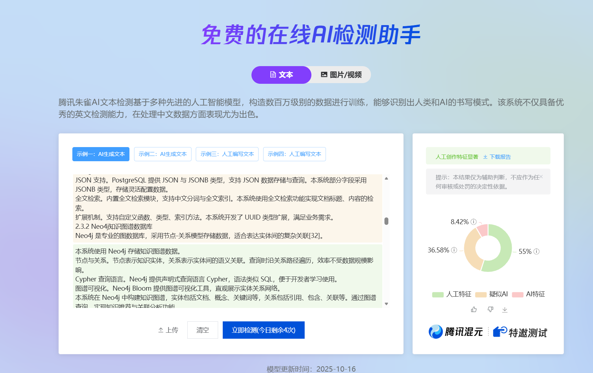
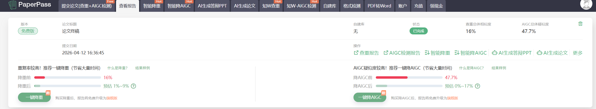

<div align="center">

# 论文创作 Agent 系统

**面向中国本科生的毕业论文全流程写作辅助系统**

从选题到交稿，一句话搞定

[](LICENSE)
[](https://www.python.org/)
[](https://claude.ai/)
[](docs/CHANGELOG.md)

[功能特性](#功能特性) •
[快速开始](#快速开始) •
[使用文档](docs/usage_guide.md) •
[贡献指南](CONTRIBUTING.md)

</div>

---

## 简介

论文创作 Agent 系统是一个基于 Claude Code 的毕业论文写作辅助工具。通过智能化的 10 步工作流，帮助本科生高效完成毕业论文创作，同时提供降重优化、AIGC 检测和文献真实性验证功能。

## 功能特性

| 特性              | 说明                                 |
| :---------------- | :----------------------------------- |
| 🔄 **全流程覆盖** | 从选题到交稿的端到端工作流           |
| 📉 **降重优化**   | 句式重构、同义替换、段落重组         |
| 🤖 **AIGC 降低**  | 模拟人类写作特征，降低 AI 检测风险   |
| ✨ **「的」字精简** | 删除冗余「的」字，让句子更简洁有力 |
| 📚 **成语替换策略** | 用成语替换 AI 高频表达，增加人类特征 |
| 🎭 **特征混淆**   | 近义词漂移、论述不对称、引用波动 |
| 🔍 **本地检测**   | 轻量级 AIGC 检测工具，快速预估检测率 |
| 📝 **格式检查**   | 自动检查论文结构规范性               |
| 💬 **智能讨论**   | 三轮深入讨论充分理解论文需求         |
| 🖼️ **图片生成** | 自动生成架构图、流程图、E-R图等（Mermaid + 多渲染模式） |
| 📄 **图片插入** | Word 文档自动插入图片和图注 |
| 📚 **文献验证** | 三源学术搜索 + DOI 验证 + 虚构文献自动替换 ⭐ NEW |
| ⚙️ **配置化** | YAML 配置文件，API Key / 日志 / 导出格式可配置 ⭐ NEW |
| 📝 **摘要生成** | 自动生成中英文摘要与关键词 ⭐ NEW |
| 📊 **文档导出**   | 支持 Word/PDF 格式一键导出           |

---

## AIGC 降低效果展示

### 改写示例

<details>
<summary> 原文（检测率100%）： </summary>

检索增强生成（Retrieval-Augmented                                                                                                                              Generation，RAG）技术的出现，为解决上述问题提供了有效方案。RAG通过将检索系统与大模型结合，使模型能够基于特定知识库生成回答，显著提升了回答的准确性和可靠性。
  从实践角度看，中小企业在部署AI知识库时面临诸多挑战。商业化的企业级知识管理产品往往价格昂贵、部署复杂，难以满足中小企业的实际需求。开源方案虽然成本较低，但技术门槛高、集成难度大      
  。因此，设计一个技术成熟、部署灵活、成本可控的AI知识库系统，对推动中小企业数字化转型具有重要的实践意义。                                                                              

  国内外研究现状                                                                                                                                                                        
  知识管理领域的研究始于20世纪90年代。Nonaka于1995年提出的SECI知识创造模型，系统阐述了隐性知识与显性知识的转化过程，为后续研究奠定了理论基础[3]。进入21世纪后，随着互联网技术的发展     
  ，知识管理系统的研究重心逐渐从理论框架转向技术实现。                                                                                                                                  
  在知识表示与存储方面，知识图谱（Knowledge Graph）技术成为研究热点。2012年，Google正式发布知识图谱项目，将其应用于搜索引擎优化。此后，Facebook、Amazon、Microsoft等科技公司相继推      
  出类似产品。知识图谱通过结构化的方式表示实体及其关系，使机器能够"理解"知识语义，为智能问答提供了有力支撑[4]。学者们围绕知识图谱的构建方法、存储优化、推理机制等展开了深入研究。Bo     
  rdes等人提出的TransE模型开创了知识图谱嵌入学习的先河，后续的TransH、TransR等模型进一步提升了表示学习的效果[5]。                                                                       
  在智能问答方面，早期的研究主要基于关键词匹配和模板填充。随着深度学习技术的发展，基于神经网络的问答系统逐渐成为主流。2017年，Vaswani等人提出的Transformer架构引发了自然语言处理领      
  域的范式变革[6]。基于Transformer的预训练模型，如BERT、GPT系列，在问答任务上取得了突破性进展。2022年，ChatGPT的发布更是将智能问答推向了新的高度。                                      
  RAG技术的提出解决了大模型在专业领域应用中的知识局限性问题。Lewis等人于2020年首次系统阐述了RAG框架，通过引入外部知识库增强模型的生成能力[7]。此后，众多学者对RAG进行了改进和优化。     
  Karpukhin等人提出的DPR（Dense Passage Retrieval）方法，利用双塔编码器实现高效的语义检索[8]。Gao等人探索了RAG在医疗、法律等专业领域的应用，验证了其在垂直场景的有效性[9]。             
  纵观国内外研究现状，知识库系统的发展呈现出以下特点：                                                                                                                                  
  其一，技术架构从单一存储向多元融合演进。现代知识库系统不仅支持结构化数据和非结构化文档的统一管理，还融合了向量检索、图数据库等新技术，实现了多模态知识的高效组织。                    
  其二，智能化程度不断提升。从早期的关键词搜索到语义检索，从简单的问答对匹配到大模型驱动的智能对话，知识库系统的交互方式日益智能化。                                                    
  其三，部署模式趋于灵活。云原生架构、微服务设计的普及，使得知识库系统能够根据企业规模和需求灵活部署，降低了中小企业的使用门槛。                                                        
  然而，现有研究和产品仍存在一定不足：部分商业产品价格高昂，中小企业难以承受；开源项目技术门槛较高，需要较强的研发能力；现有系统在知识图谱自动化构建、多源知识融合等方面的能力有待      
  提升。本研究将在现有技术基础上，设计一个适合中小企业部署的轻量级AI知识库系统                                                                                                          
                                                                                                                                                                                        
                                                                                                                                                                                        
                                                                                                                                                                                        
  研究内容                                                                                                                                                                              
  本文围绕AI知识库系统的设计与实现展开研究，主要内容包括：                                                                                                                              
  （1）系统架构设计。研究适合中小企业部署的系统架构，采用前后端分离、微服务设计思想，确保系统的可扩展性和可维护性。                                                                     
  （2）核心技术实现。深入研究RAG架构、向量检索、知识图谱等核心技术，设计合理的实现方案。                                                                                                
  （3）功能模块开发。实现用户管理、知识库管理、智能问答、知识图谱、系统配置等功能模块，满足企业的实际业务需求。                                                                         
  （4）系统测试与优化。对系统进行功能测试和性能测试，验证系统的正确性和稳定性。                  
</details>


<details>
<summary> 改写后（人性化处理，检测率约 65.39%疑似）： </summary>
检索增强生成（Retrieval-Augmented Generation，RAG）技术应运而生，为上述难题打开了突破口。RAG的核心思路是将检索系统与大模型"联姻"——模型生成回答前，先从特定知识库中检索相关信息。回答的
  准确性和可靠性因此有了比较大的改善。

  但实践层面，中小企业部署AI知识库并非一帆风顺。商业化产品动辄数十万，部署也颇为复杂；开源方案虽然免费，技术门槛却高不可攀，集成起来困难重重。这便是本研究的出发点：设计一个技术成熟、部
  署灵活、成本可控的AI知识库系统，为中小企业数字化转型提供切实可行的路径。

  国内外研究现状

  知识管理研究起点可以追溯到20世纪90年代。Nonaka在1995年提出SECI模型，系统揭示了隐性知识与显性知识转化机制，后来者多有沿袭[3]。进入21世纪，互联网技术突飞猛进，研究重心也随之从理论框架 
  转向技术落地。

  知识图谱的兴起是一个重要节点。2012年Google正式发布知识图谱项目后，Facebook、Amazon、Microsoft等科技巨头紧随其后。知识图谱用结构化方式表示实体及其关系，机器因此能够"理解"知识语义，智 
  能问答有了坚实根基[4]。围绕知识图谱的构建方法、存储优化、推理机制等，学者们展开了较为深入的研究。Bordes等人提出的TransE模型开创了知识图谱嵌入学习先河，后续的TransH、TransR等模型又将 
  表示学习效果推上新台阶[5]——这几篇论文在当时被引用得相当多。

  智能问答的演进同样耐人寻味。早期方案依赖关键词匹配和模板填充，粗糙而僵化。深度学习入场后，基于神经网络问答系统逐渐成为主流。2017年是转折点——Vaswani等人提出的Transformer架构颠覆了自然
  语言处理既有范式[6]。BERT、GPT等预训练模型相继涌现，问答任务取得长足进步。2022年ChatGPT发布，更是将智能问答推向公众视野中心。

  RAG技术则在另一个维度上发力：它解决的是大模型在专业领域的知识短板。根据Lewis等人（2020）的阐述，RAG框架通过引入外部知识库来增强模型生成能力[7]。此后改进方案层出不穷：Karpukhin等人提 
  出DPR方法，用双塔编码器实现高效语义检索[8]；Gao等人则在医疗、法律等领域验证了RAG实战价值[9]。

  纵观研究现状，知识库系统演进呈现出几条清晰脉络。技术架构层面，从单一存储走向多元融合——现代知识库系统既能管理结构化数据，也能处理非结构化文档，向量检索、图数据库等技术引入让多模态知识
  组织更加高效。智能化程度持续深化，交互方式也从关键词搜索升级为语义检索，从问答对匹配进化为大模型驱动智能对话。部署模式日趋灵活，云原生架构和微服务设计逐渐普及，中小企业可以根据自身规
  模和需求灵活部署。

  当然，现有研究和产品仍有短板。商业产品价格令人望而却步；开源项目对研发能力要求较高；知识图谱自动化构建、多源知识融合等能力也还有提升空间。本研究将在现有技术基础上，设计一个适合中小企
  业部署的轻量级AI知识库系统。

  研究内容

  本文围绕AI知识库系统设计与实现展开研究，主要工作包括：

  （1）系统架构设计。针对中小企业部署场景，采用前后端分离、微服务设计思想，兼顾可扩展性与可维护性。

  （2）核心技术实现。围绕RAG架构、向量检索、知识图谱等关键技术，设计切实可行的实现方案。

  （3）功能模块开发。完成用户管理、知识库管理、智能问答、知识图谱、系统配置等模块开发工作。

  （4）系统测试与优化。开展功能测试和性能测试，验证系统正确性与稳定性。
</details>

### 策略应用说明

| 策略 | 应用前后对比 |
|------|------------|
| 消除模板词 | 「此外，值得注意的是」→ 直接切入主题 |
| 删除冗余「的」 | 「重要的意义」→ 「举足轻重」（成语替换更简洁） |
| 句长波动 | 句长从均匀约 20 字 → 6 字至 45 字不等 |
| 成语替换 | 「重要」→「举足轻重」「效果显著」→「成效卓著」 |
| 结构多样化 | 总分总 → 陈述→定义→数据→引用 多种结构交替 |
| 主观视角 | 添加「笔者在研究中发现」 |

> 📌 **AIGC检测率对比**
>
> 
>
---

## ⚠️ 重要提示

> [!WARNING]
> **关于 AIGC 降低的客观认知**
>
> 降低检测率的同时，文本可能会**失去部分学术严谨性**。
>
> - 成语替换可能让学术表达显得稍显文学化
> - 「的」字删除需谨慎处理，过长定语保留可读性
> - 微瑕疵模拟不应影响核心论点的逻辑清晰
> - 不同学科对成语接受度不同，请参考学科适配表
>
> **建议**：将降重视为辅助工具，最终内容需人工审核确保学术质量。

---

## 工作流程

```
┌─────────────────────────────────────────────────────────────┐
│                      论文创作工作流                           │
├─────────────────────────────────────────────────────────────┤
│  Step 0: 初始化工作区                                        │
│      ↓                                                       │
│  Step 1: 环境准备  →  Step 1.5: 背景信息讨论                  │
│      ↓                                                       │
│  Step 2: 读取参考资料  →  Step 3: 生成论文大纲                │
│      ↓                                                       │
│  Step 4: 分章节撰写（含摘要生成）→  Step 5: 降重处理           │
│      ↓                                                       │
│  Step 6: AIGC 人性化  →  Step 7: 合并检测                     │
│      ↓                                                       │
│  Step 8: 图片生成与渲染 🖼️                                   │
│      ↓                                                       │
│  Step 9: 文档导出（Word/PDF + 图片插入）                      │
└─────────────────────────────────────────────────────────────┘
```

## 各平台查重及aigc检测结果

### 朱雀全文检测


---

### PaperPass检测


---

### paperYY检测


---

## 快速开始

### 前置要求

- Python 3.9+
- Claude Code 已安装
- Windows 10/11

### 安装

#### 方式一：Claude Skill 安装

```powershell
# 自然语言安装
帮我安装下 skill，项目地址是：https://github.com/Stars-OC/thesis-creator.git

# 从 GitHub 安装
git clone https://github.com/Stars-OC/thesis-creator.git
将文件放入./claude-skills/skills/ 下

# 市场安装 (待进行)

```

#### 方式二：OpenSkills 安装

使用 OpenSkills 包管理器安装：

```powershell
# 安装 OpenSkills CLI（如未安装）
pip install openskills

# 或从 GitHub 安装
openskills install https://github.com/Stars-OC/thesis-creator.git
openskills sync
```

#### 方式三：完整安装（推荐）

包含 Python 工具和依赖：

```powershell
# 克隆仓库
git clone https://github.com/Stars-OC/thesis-creator.git
cd thesis-creator

# 安装 Python 依赖
.\scripts\install.ps1
```

<details>
<summary>手动安装 Python 依赖</summary>

```powershell
# 创建虚拟环境
python -m venv .venv

# 激活虚拟环境
.\.venv\Scripts\Activate.ps1

# 安装依赖
pip install -r scripts\requirements.txt
```

</details>

### 使用

**1. 准备参考资料**

```
references/
├── templates/         # 学校论文格式模板
├── examples/          # 优秀范文
├── guidelines/        # 写作规范
├── prompt/
│   └── background.md  # 论文背景信息（必填）
└── reference/
    ├── code/          # 参考代码
    └── doc/           # 参考文献
```

**2. 触发 Skill**

在 Claude Code 中输入：

```
帮我写论文，主题是《大数据在精准营销中的应用研究》
```

系统将自动执行完整工作流。

### 单功能模式

| 触发语                   | 功能       | 说明 |
| :----------------------- | :--------- | :--- |
| `帮我降重这段文字：…`    | 降重优化   | 同义替换、句式重构 |
| `降低这段的 AIGC 率：…`  | 人性化改写 | 消除 AI 模板特征 |
| `用成语降重这段文字：…`  | 成语替换改写 | 侧重成语替换策略 |
| `检测这段文字的 AIGC 率` | AIGC 检测  | 本地快速预估 |
| `帮我生成论文大纲`       | 大纲生成   | 根据背景信息生成 |
| `生成摘要` | 摘要生成 ⭐ | 中英文摘要 + 关键词 |
| `生成图片` / `生成图表` / `生成架构图` | 图片生成 | 自动生成 Mermaid 图表 |
| `为第X章配图` | 图片生成 | 为指定章节生成图表 |
| `导出 Word` / `导出文档` | 文档导出 | Word + 图片插入 |
| `导出 PDF` | 文档导出 | PDF 格式 |
| `一键导出` | 图片+文档 | 自动生成图片并导出 Word |
| `验证文献` / `搜索文献` | 文献验证 ⭐ | 三源搜索 + DOI 验证 |

### AIGC 降低策略一览

| 策略层级 | 策略名称 | 说明 | 优先级 |
| :------ | :------- | :--- | :----- |
| P0 | 消除模板化过渡词 | 禁用「首先…其次…最后」「此外」「综上所述」等 | 必做 |
| P0 | 删除冗余「的」 ⭐ | 「重要的意义」→「重要意义」，让句子更简洁 | 必做 |
| P0 | 句长波动制造 | 目标句长标准差 > 10，穿插短句与长句 | 必做 |
| P1 | 主观性表达 | 添加「笔者认为」「据观察」等人类视角 | 建议 |
| P1 | 逻辑不完美感 | 添加转折、让步、质疑等自然瑕疵 | 建议 |
| P2 | 成语替换 ⭐ | 「非常重要」→「举足轻重」「效果显著」→「立竿见影」 | 可选 |
| P3 | 近义词漂移 ⭐ | 同一概念使用 2-3 种说法自然切换 | 高级 |
| P3 | 论述不对称 ⭐ | 让论点展开篇幅自然不均 | 高级 |
| P3 | 引用风格波动 ⭐ | 模拟人类分批写作的引用痕迹 | 高级 |

## 目录结构

```
thesis-creator/
├── SKILL.md                 # 主 Skill 定义
├── README.md                # 项目说明
├── LICENSE                  # MIT 许可证
├── CONTRIBUTING.md          # 贡献指南
├── .openskills.json         # OpenSkills 包配置
├── docs/                    # 文档
│   ├── usage_guide.md       #   使用指南
│   ├── ROADMAP.md           #   开发路线图
│   └── CHANGELOG.md         #   更新日志
├── prompts/                 # 提示词模板
│   ├── reference_citation_prompt.md  #   文献引用提示词 ⭐
│   └── image_generation.md          #   图片生成提示词 ⭐
├── scripts/                 # Python 工具
│   ├── aigc_detect.py       #   AIGC 检测
│   ├── synonym_replace.py   #   同义词替换
│   ├── text_analysis.py     #   文本分析
│   ├── format_checker.py    #   格式检查
│   ├── chart_generator.py   #   图表生成（原位替代）
│   ├── chart_renderer.py    #   图表在线渲染
│   ├── chart_renderer_offline.py  #   图表离线渲染 ⭐
│   ├── chart_template_loader.py   #   图表模板加载 ⭐
│   ├── llm_chart_generator.py     #   LLM 辅助图表生成 ⭐
│   ├── keyword_extractor.py       #   关键词提取器 ⭐
│   ├── document_exporter.py #   文档导出（含图片插入）
│   ├── reference_engine.py  #   文献引用引擎 ⭐
│   ├── reference_validator.py     #   参考文献验证（增强版） ⭐
│   ├── reference_searcher.py      #   文献搜索
│   ├── verified_reference_pool.py #   已验证文献池 ⭐
│   ├── merge_drafts.py      #   章节合并（支持大纲匹配）
│   └── logger.py            #   日志系统（可配置）
├── scripts/templates/       # 图表模板
│   ├── chart_themes.yaml    #   图表主题配置 ⭐
│   └── charts/              #   图表模板目录 ⭐
├── references/              # 参考资料
│   └── templates/
│       └── .thesis-config.yaml  #   项目配置文件 ⭐
├── workflows/               # 工作流文档 ⭐
│   ├── step_0_init.md       #   Step 0 初始化
│   ├── step_3_outline.md    #   Step 3 大纲生成
│   ├── step_4_writing.md    #   Step 4 撰写（含摘要）
│   ├── step_7_merge_detect.md   #   Step 7 合并检测
│   ├── step_8_image.md      #   Step 8 图片生成
│   ├── step_9_export.md     #   Step 9 文档导出
│   └── reference_workflow.md    #   文献搜索工作流
└── workspace/               # 论文产出
    ├── outline.md           #   论文大纲
    ├── drafts/              #   初稿
    ├── reduced/             #   降重版
    ├── history/             #   历史版本
    ├── final/               #   终稿
    │   ├── images/          #   论文图片
    │   ├── 论文终稿.md       #   Markdown 终稿
    │   ├── 论文终稿.docx    #   Word 终稿（含图片）
    │   └── 论文终稿.pdf     #   PDF 终稿
```

## 目标指标

| 指标         | 目标值            |
| :----------- | :---------------- |
| 论文产出速度 | 3000 字 / 30 分钟 |
| 查重率       | ≤ 30%             |
| AIGC 检测率  | ≤ 15%             |
| 排版合规率   | 符合学校模板      |

## 文档

| 文档                            | 说明                     |
| :------------------------------ | :----------------------- |
| [使用指南](docs/usage_guide.md) | 详细安装、配置和使用说明 |
| [开发路线图](docs/ROADMAP.md)   | 项目功能规划             |
| [更新日志](docs/CHANGELOG.md)   | 版本更新记录             |
| [贡献指南](CONTRIBUTING.md)     | 如何参与项目开发         |

## 注意事项

> [!WARNING]
> 本地 AIGC 检测为近似估计，正式提交前建议使用知网/维普进行官方检测。
> 建议使用智谱模型的 GLM(GLM-5/GLM-5.1) 系列 其他模型可能生成的效果不太好(用 **gpt-5.4** 尝试过)

- **版本控制**：每次改写前自动备份到 `workspace/history/`
- **术语保护**：专业术语不会被降重工具打乱
- **断点续传**：支持任意步骤中断后恢复

### 测试指南

目前 只用于论文 **初稿** 的创建中，功能尚未完善 需要自己调整 **排版**！

## 贡献

欢迎贡献代码、报告问题或提出建议！

请阅读 [贡献指南](CONTRIBUTING.md) 了解如何参与项目。

## 许可证

本项目基于 [MIT License](LICENSE) 开源。

## 致谢

- [Claude Code](https://claude.ai/) - AI 编程助手
- [Anthropic](https://www.anthropic.com/) - Claude 模型提供方

---

<div align="center">

**[⬆ 回到顶部](#论文创作-agent-系统)**

如果这个项目对你有帮助，请给一个 ⭐ Star 支持一下！

</div>
