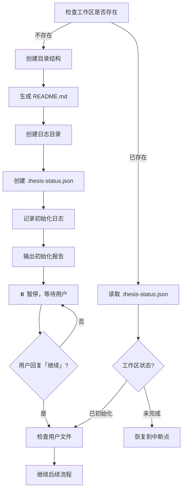
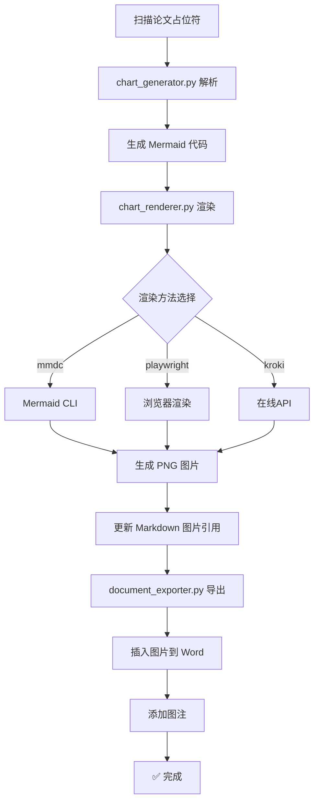
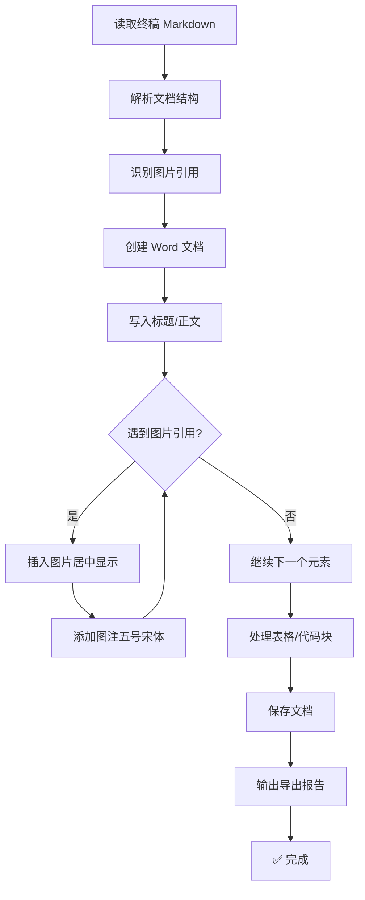

# 论文创作 Agent 系统

面向中国本科生的**毕业论文全流程写作辅助系统**。从选题到交稿的端到端工作流。

---

## 核心原则

> [!IMPORTANT]
> **工作区隔离原则**：AI 始终在**用户项目目录**下的 `thesis-workspace/` 工作，而非 Skill 自身目录。所有参考资料、产出文件都在用户工作区内。

---

## 触发条件

- 「帮我写论文，主题是…」
- 「帮我降重这段文字…」
- 「降低这段的 AIGC 率…」
- 「用成语降重这段文字…」 ⭐ 新增
- 「检测这段文字的 AIGC 率」
- 「帮我生成论文大纲」
- 「初始化工作区」
- 「继续」（初始化完成后继续流程）

---

## ⚠️ 重要提示

> [!WARNING]
> **关于 AIGC 降低的客观认知**
>
> 降低检测率的同时，文本可能会**失去部分学术严谨性**。
>
> - 成语替换可能让学术表达显得稍显文学化
> - 「的」字删除需谨慎处理，过长定语保留可读性
> - 微瑕疵模拟不应影响核心论点的逻辑清晰
> - 不同学科对成语接受度不同，请参考学科适配表
>
> **建议**：将降重视为辅助工具，最终内容需人工审核确保学术质量。

---

## 用户工作区目录结构

```
thesis-workspace/              # 用户工作区（AI 在此工作）
├── README.md                  # 工作区使用说明（初始化时生成）
├── references/                # 参考资料（用户放入）
│   ├── templates/             #   学校格式模板
│   ├── examples/              #   优秀范文
│   ├── guidelines/            #   写作规范
│   ├── prompt/                #   背景信息
│   │   └── background.md      #   必填：论文背景信息
│   └── reference/             #   参考资料目录
│       ├── code/              #   参考代码
│       └── doc/               #   参考文献
├── workspace/                 # 论文产出（AI 生成）
│   ├── outline.md             #   论文大纲
│   ├── drafts/                #   各章节初稿
│   ├── reduced/               #   降重后版本
│   ├── history/               #   历史版本备份
│   └── final/                 #   最终成稿
├── logs/                      # 执行日志（每次运行生成）
│   ├── YYYYMMDD_HHMMSS/       #   按时间戳分目录
│   │   ├── step_0_init.log    #   各步骤日志
│   │   ├── step_3_outline.log
│   │   ├── warnings.log       #   警告汇总
│   │   └── session_summary.md #   会话总结
│   └── latest -> YYYYMMDD_HHMMSS/  # 最新日志软链接
└── .thesis-status.json        # 流程状态记录
```

---

## 通性问题防错机制

> [!IMPORTANT]
> 以下问题在**各步骤中自动检查**，无需用户额外关注。每个步骤执行后都会生成检查报告。

| # | 问题 | 影响 | 防错步骤 | 检查时机 |
|---|------|------|----------|----------|
| 1 | 缺少规定动作章节 | 🔴 致命 | Step 3 大纲生成时强制包含 | 大纲确认后 |
| 2 | 设计与实现未分离 | 🔴 致命 | Step 3 强制第4章设计、第5章实现 | 大纲生成时 |
| 3 | 图表严重不足 | 🔴 致命 | Step 4 每章节强制图表占位符 | 每章完成后 |
| 4 | 代码堆砌 | ⚠️ 严重 | Step 4 代码≤20行强制检查 | 每章完成后 |
| 5 | 参考文献虚构 | ⚠️ 严重 | Step 4 引用必须有来源标记 | 写作时 |
| 6 | 篇幅分配失衡 | ⚠️ 中等 | Step 3 自动按比例分配 | 大纲生成时 |

---

## 工作流程

### Step 0: 初始化工作区 ⏸️

**触发**：
- 「初始化工作区」
- 或首次执行「帮我写论文」时自动触发

**执行流程**：



**详细步骤**：

1. **检查工作区**
   - 检查 `<用户项目目录>/thesis-workspace/` 是否存在
   - 读取 `.thesis-status.json` 判断当前状态

2. **创建工作区**（如不存在）
   - 创建完整目录结构
   - 生成 `README.md` 使用说明
   - 创建 `logs/` 目录
   - 复制模板文件：
     - `references/prompt/background_template.md` → `references/prompt/background.md`
   - 初始化 `.thesis-status.json`

3. **记录日志**
   - 创建日志目录：`logs/YYYYMMDD_HHMMSS/`
   - 写入 `step_0_init.log`：记录初始化详情
   - 更新 `logs/latest` 软链接

4. **输出初始化报告并暂停**
   ```
   ✅ 工作区初始化完成！

   📂 工作区位置：thesis-workspace/
   📝 日志目录：thesis-workspace/logs/latest/

   📋 请按以下步骤准备参考资料：

   1. 打开 thesis-workspace/README.md 阅读详细说明
   2. 将学校模板放入 references/templates/
   3. 将优秀范文放入 references/examples/
   4. 将写作规范放入 references/guidelines/
   5. 填写 references/prompt/background.md（必填）
   6. 将参考文献放入 references/reference/doc/
   7. 将参考代码放入 references/reference/code/

   ⏸️ 准备完成后，请回复「继续」开始论文创作。
   ```

5. **等待用户确认**
   - 用户回复「继续」后，检查文件准备情况
   - 输出文件检查报告
   - 继续后续流程

**防呆机制**：
- 目录已存在 → 询问是否重置
- 文件已存在 → 保留用户版本，不覆盖

**状态记录** (`.thesis-status.json`)：
```json
{
  "version": "1.0",
  "status": "initialized",
  "created_at": "2026-03-06T15:00:00",
  "current_step": 0,
  "steps_completed": ["initialization"],
  "warnings": [],
  "last_updated": "2026-03-06T15:00:00"
}
```

---

### Step 1: 环境准备

**执行**：
1. 创建 `workspace/` 子目录
2. 检查 `references/` 目录，扫描用户文件
3. 输出状态报告

**日志记录**：
- `logs/<timestamp>/step_1_env.log`

**防呆**：自动排除 `README.md`、`template.md` 等说明文件。

---

### Step 1.5: 背景信息讨论 ⭐

> 详见 `prompts/discussion_guide.md`

**流程**：
1. 检查 `background.md` 是否存在
2. 进行三轮讨论（研究主题 → 研究方法 → 论文结构）
3. 生成背景确认报告
4. 用户确认后进入下一步

**日志记录**：
- `logs/<timestamp>/step_1.5_discussion.log`
- 记录每轮讨论要点和用户确认内容

---

### Step 2: 读取参考资料

**执行**：
1. 读取 `templates/` → 提取格式规范
2. 读取 `examples/` → 学习写作风格
3. 读取 `guidelines/` → 了解硬性要求
4. 读取 `reference/` → 参考用户资料

**输出**：参考资料分析摘要

**日志记录**：
- `logs/<timestamp>/step_2_references.log`
- 记录各目录文件列表和分析结果

---

### Step 3: 生成论文大纲 🛡️

> 详见 `prompts/thesis_structure.md`

**执行**：
1. 根据主题生成符合规范的大纲
2. 为每个章节预估字数
3. 生成图表占位符清单
4. 保存到 `workspace/outline.md`

**🛡️ 防错检查（自动执行）**：

| 检查项 | 要求 | 不达标处理 |
|--------|------|-----------|
| 规定动作章节 | 必须包含：绪论、国内外研究现状、可行性分析、结论 | 自动补充缺失章节 |
| 设计实现分离 | 第4章设计、第5章实现，不可合并 | 强制拆分 |
| 篇幅比例 | 正文各章字数合理分配 | 提示建议比例 |

**用户交互**：用户可修改大纲，确认后进入下一步

**日志记录**：
- `logs/<timestamp>/step_3_outline.log`
- 记录大纲生成过程和防错检查结果

**警告记录**：
- 如有未达标项，写入 `logs/<timestamp>/warnings.log`

---

### Step 4: 分章节撰写 🛡️

> **必须加载的 Prompt 文件**（写作前先读取）：
> - `prompts/writer_guidelines.md` — 写作规范（两阶段写作法）
> - `prompts/aigc_reducer_prompt.md` — **AIGC 降重核心策略** ⭐
> - `prompts/humanizer_guidelines.md` — 人性化改写指南
> - `prompts/reference_format_gbt7714.md` — 参考文献格式规范

**规则**：
- 每段 150-300 字，包含论点+论据+小结
- 每千字至少 2 个文献引用（GB/T 7714-2015）
- 代码片段不超过 20 行，需有设计说明和效果分析
- 使用图表占位符标记图表位置
- **AIGC 降重要求**（写作时同步执行）：
  - 禁用「首先…其次…最后」「此外」「综上所述」等 AI 模板词
  - 句长波动：目标句长标准差 > 10
  - 段落结构多样：避免连续 3 段使用相同的「总分」结构
  - 穿插主观视角：「笔者认为」「据观察」等

**执行**：
```
for 每个章节 in outline:
    0. 📖 加载 AIGC 降重 prompt（aigc_reducer_prompt.md）
    1. 检查是否为"规定动作"章节
    2. 生成内容（同步应用 AIGC 降重策略）
    3. 生成图表占位符
    4. 🛡️ 执行防错检查（含 AIGC 特征检查）
    5. 保存到 workspace/drafts/
    6. 记录日志
```

**🛡️ 防错检查（每章完成后自动执行）**：

| 检查项 | 要求 | 不达标处理 |
|--------|------|-----------|
| 图表占位符 | 每章至少 2 个图表占位符 | 提示补充 |
| 代码长度 | ≤20 行，且需设计说明+效果分析 | 拆分或精简 |
| 参考文献标记 | 引用需标注来源 | 标记缺失位置 |
| 段落结构 | 论点+论据+小结 | 提示优化 |
| **AI 模板词** | **无「首先…其次…最后」「此外」「综上所述」** | **自动替换** |
| **句长波动** | **句长标准差 > 10** | **调整句式** |
| **段落开头** | **相邻段落首词不得相同** | **修改开头** |

**日志记录**：
- `logs/<timestamp>/step_4_chapter_N.log`（每章一个日志）
- 记录章节生成详情和检查结果

**警告记录**：
- 代码过长 → 记录到 `warnings.log`
- 图表不足 → 记录到 `warnings.log`
- **AI 模板词超标** → 记录到 `warnings.log`
- **句长波动不足** → 记录到 `warnings.log`

---

### Step 5: 降重处理

> 详见 `prompts/reducer_guidelines.md`

**策略**：句式重构、同义替换、段落重组、引用编织

**执行**：
1. 备份原文件到 `history/`
2. 执行降重改写
3. 可选：调用 `scripts/synonym_replace.py`

**日志记录**：
- `logs/<timestamp>/step_5_reduce.log`
- 记录降重前后对比、修改统计

---

### Step 6: AIGC 人性化

> 详见 `prompts/humanizer_guidelines.md` 和 `prompts/aigc_reducer_prompt.md`

**策略**：
- 消除模板化过渡词
- 句长随机波动（10-50字）
- 添加主观性表达
- **成语替换同义词** ⭐ 新增（详见 `prompts/idiom_replacement_dict.md`）

**成语替换原理**：
- 成语是汉语言文化的精华，具有独特的人类思维印记
- AI 模型倾向于使用通用的同义词替换，而人类更喜欢用成语表达丰富的含义
- 利用成语替换同义词，可以有效消除「AI 味道」

**常用成语替换示例**：
| AI 高频表达 | 成语替换 |
|------------|---------|
| 非常重要 | 举足轻重、至关重要 |
| 效果显著 | 立竿见影、成效卓著 |
| 快速发展 | 日新月异、突飞猛进 |
| 密切相关 | 息息相关、休戚与共 |

**自检循环**：检测 → AIGC率≤阈值? → 通过/改写（最多3轮）

**日志记录**：
- `logs/<timestamp>/step_6_humanize.log`
- 记录每轮检测结果和改写内容

---

### Step 7: AIGC 检测 🛠️

**检查项**：

| 检查项 | 方式 | 日志位置 |
|--------|------|----------|
| 规定动作检查 | 确保章节完整 | step_7_final.log |
| 格式检查 | 调用 `scripts/format_checker.py` | step_7_format.log |
| 图表完整性 | 检查占位符数量和状态 | step_7_final.log |
| AIGC 检测 | 调用 `scripts/aigc_detect.py` | step_7_aigc.log |
| 写作质量 | 调用 `scripts/text_analysis.py` | step_7_quality.log |

**章节合并**：

使用 `scripts/merge_drafts.py` 合并各章节文件：

```bash
# 合并所有章节
python scripts/merge_drafts.py -i workspace/drafts/ -o workspace/final/论文终稿.md

# 查看统计信息
python scripts/merge_drafts.py -i workspace/drafts/ -o workspace/final/论文终稿.md --stats
```

**merge_drafts.py 功能特点**：
- 自动按章节编号排序（1-7章 + 参考文献 + 致谢）
- 添加分页标记，便于 Word 导出
- 原子写入，避免文件损坏
- 输出详细的字数统计

**输出**：
- `workspace/final/论文终稿.md`
- `workspace/final/quality_report.md`
- `logs/<timestamp>/session_summary.md`（会话总结）

---

### Step 8: 图片生成与渲染 🖼️ ⭐ NEW

> **整合流程：图片生成 → 渲染 → 插入到 Word**

**触发**：
- 用户说「生成图片」「为第X章配图」「生成系统架构图」等
- 或在 AIGC 检测通过后自动提示
- 或在导出文档前自动执行

**完整工作流**：



**支持的图片类型**：

| 图片类型 | Mermaid 语法 | 适用章节 | 示例 |
|----------|-------------|----------|------|
| 系统架构图 | `graph TB` | 第4章 系统设计 | 三层架构、模块关系 |
| 流程图 | `flowchart TD` | 第4-5章 功能设计/实现 | 登录流程、业务流程 |
| E-R 图 | `erDiagram` | 第4章 数据库设计 | 实体关系图 |
| 用例图 | `graph LR` | 第4章 需求分析 | 用户用例 |
| 时序图 | `sequenceDiagram` | 第5章 接口调用 | API交互时序 |
| 类图 | `classDiagram` | 第5章 类设计 | 类结构关系 |

**一键执行命令**：

```bash
# 方式1: 分步执行（可单独调试）
# Step 1: 从占位符生成 Mermaid 代码
python scripts/chart_generator.py workspace/drafts/ --output workspace/final/images/

# Step 2: 渲染 Mermaid 为 PNG
python scripts/chart_renderer.py --input workspace/final/论文终稿.md --output workspace/final/images/ --method auto

# Step 3: 导出 Word（自动插入图片）
python scripts/document_exporter.py --input workspace/final/论文终稿.md --output workspace/final/ --format docx

# 方式2: 一键完成（推荐）
# AI 自动执行完整流程：扫描 → 生成 → 渲染 → 插入 → 导出
```

**渲染方法选项**：

| 方法 | 说明 | 优先级 | 依赖 |
|------|------|--------|------|
| `mmdc` | Mermaid CLI（本地） | 1 | `npm install -g @mermaid-js/mermaid-cli` |
| `playwright` | 浏览器渲染（本地） | 2 | `pip install playwright && playwright install` |
| `kroki` | 在线 API | 3 | 需要网络 |
| `auto` | 自动选择（按优先级尝试） | - | 已安装的优先 |

**输出文件**：
- `workspace/final/images/图X-X.png` - 渲染后的图片
- `workspace/final/images/image_manifest.md` - 图片清单
- `workspace/final/images/chart_report.md` - 图表生成报告

**日志记录**：
- `logs/<timestamp>/step_8_image_gen.log`

**🛡️ 防错检查**：

| 检查项 | 要求 | 不达标处理 |
|--------|------|-----------|
| 图片分辨率 | ≥ 72 DPI（电子稿） | 重新生成 |
| 图片格式 | PNG | 自动转换 |
| 图片命名 | 按「图X-X 说明」格式 | 自动重命名 |
| 图片引用 | 每章至少 2 张图 | 提示补充 |
| 图片插入 | Word 中正确显示 | 检查路径 |

---

### Step 9: 文档导出与图片插入 📄 ⭐ 优化

> **自动将图片插入到 Word 文档，并添加规范图注**

**触发**：
- AIGC 检测通过后自动提示
- 用户说「导出 Word」「导出 PDF」「生成文档」

**执行流程**：



**图片插入特性**：

| 特性 | 说明 | 格式标准 |
|------|------|----------|
| 自动居中 | 图片居中显示 | `WD_ALIGN_PARAGRAPH.CENTER` |
| 尺寸控制 | 默认宽度 12cm | 适合 A4 纸张 |
| 图注格式 | 五号宋体、居中 | 符合学术论文规范 |
| 路径解析 | 支持相对路径 | 自动转换为绝对路径 |
| 失败处理 | 图片不存在时记录警告 | 不中断导出流程 |

**导出格式选项**：

| 选项 | 说明 | 输出文件 |
|------|------|----------|
| `docx` | Word 文档（含图片） | `论文终稿.docx` |
| `pdf` | PDF 文档 | `论文终稿.pdf` |
| `both` | 同时导出两种格式 | `.docx` 和 `.pdf` |

**使用方法**：

```bash
# 导出 Word 文档（自动插入图片）
python scripts/document_exporter.py --input workspace/final/论文终稿.md --output workspace/final/ --format docx

# 导出 PDF 文档
python scripts/document_exporter.py --input workspace/final/论文终稿.md --output workspace/final/ --format pdf

# 同时导出两种格式
python scripts/document_exporter.py --input workspace/final/论文终稿.md --output workspace/final/ --format both
```

**导出成功示例**：

```
[信息] 正在读取: workspace/final/论文终稿.md
[成功] Word 文档已保存: workspace/final/论文终稿.docx
[信息] 成功插入 12 张图片
==================================================
[文档导出报告]
输入文件: workspace/final/论文终稿.md
输出目录: workspace/final/
导出时间: 20260411_194041
--------------------------------------------------
DOCX: [成功]
  路径: workspace/final/论文终稿.docx
  图片: 12 张已插入
==================================================
```

**PDF 转换依赖**（选择其一）：
- `pip install docx2pdf`（推荐，简单易用）
- LibreOffice（跨平台）
- Microsoft Word（仅 Windows）

**日志记录**：
- `logs/<timestamp>/step_9_export.log`

**输出文件**：
- `workspace/final/论文终稿.docx`（Word 文档，含图片）
- `workspace/final/论文终稿.pdf`（PDF 文档）
- `workspace/final/导出报告.md`
- `workspace/final/导出报告.md`

**文档格式规范**：
- 页边距：上下 2.54cm，左右 3.17cm
- 正文字体：宋体 12pt
- 标题字体：黑体，一级标题 14pt，二级标题 12pt
- 行距：1.5 倍行距
- 首行缩进：0.74cm（两个字符）

---

## 单功能模式

| 触发语 | 执行动作 |
|--------|----------|
| 「帮我降重这段文字：…」 | 仅 Step 5 |
| 「降低这段的 AIGC 率：…」 | 仅 Step 6 |
| 「用成语降重这段文字：…」 | Step 6（侧重成语替换） ⭐ |
| 「检测这段文字的 AIGC 率」 | 调用 `aigc_detect.py` |
| 「帮我生成论文大纲」 | Step 1-3 |
| 「生成图片」「生成图表」「生成系统架构图」 | Step 8（图片生成+渲染） ⭐ |
| 「为第X章配图」 | Step 8（图片生成+渲染） ⭐ |
| 「导出 Word」「导出文档」「生成Word」 | Step 9（导出Word+插入图片） ⭐ |
| 「导出 PDF」「生成PDF」 | Step 9（导出PDF） |
| 「一键导出」 | Step 8+9（图片+文档） ⭐ 推荐 |

---

## 错误处理

| 场景 | 处理策略 |
|------|----------|
| 模型下载失败 | 回退到轻量版检测 |
| PDF 无法解析 | 提示手动提取 |
| 3轮改写未达标 | 输出最佳版本+风险标记 |
| 图片文件不存在 | 记录警告，继续导出 |
| 图片渲染失败 | 尝试其他渲染方法 |

---

## 日志系统

### 日志目录结构

```
logs/
├── 20260306_150000/           # 第一次会话
│   ├── step_0_init.log        # 初始化日志
│   ├── step_1_env.log         # 环境准备
│   ├── step_1.5_discussion.log # 背景讨论
│   ├── step_2_references.log  # 参考资料分析
│   ├── step_3_outline.log     # 大纲生成
│   ├── step_4_chapter_1.log   # 各章节撰写
│   ├── step_4_chapter_2.log
│   ├── ...
│   ├── step_5_reduce.log      # 降重处理
│   ├── step_6_humanize.log    # AIGC 人性化
│   ├── step_7_aigc.log        # AIGC 检测详情
│   ├── step_7_final.log       # 最终检查
│   ├── step_8_image_gen.log   # 图片生成与渲染 ⭐ 整合
│   ├── step_9_export.log      # 文档导出与图片插入 ⭐ 整合
│   ├── warnings.log           # ⚠️ 警告汇总
│   └── session_summary.md     # 会话总结报告
└── latest -> 20260306_150000/ # 最新日志快捷访问
```

### 日志格式

每条日志包含：
```
[时间戳] [步骤] [级别] 消息内容
[2026-03-06 15:00:00] [Step 3] [INFO] 开始生成论文大纲
[2026-03-06 15:00:05] [Step 3] [WARN] 检测到缺少"可行性分析"章节，已自动补充
[2026-03-06 15:00:10] [Step 3] [INFO] 大纲生成完成，共 5 章
```

### warnings.log 专用格式

```
⚠️ 警告报告
生成时间：2026-03-06 15:30:00
总警告数：3

---
[Step 3] 缺少规定动作章节 → 已自动补充"可行性分析"
[Step 4-2] 代码片段过长（35行）→ 第4章第2节，建议拆分
[Step 4-3] 图表占位符不足 → 第4章第3节仅1个图表，建议补充
```

### session_summary.md 模板

```markdown
# 论文创作会话总结

**时间**：2026-03-06 15:00:00 - 16:30:00
**主题**：《大数据在精准营销中的应用研究》

## 完成步骤
- [x] Step 0: 工作区初始化
- [x] Step 1: 环境准备
- [x] Step 1.5: 背景讨论
- [x] Step 2: 读取参考资料
- [x] Step 3: 生成大纲
- [x] Step 4: 分章节撰写（5章）
- [x] Step 5: 降重处理
- [x] Step 6: AIGC 人性化
- [x] Step 7: AIGC 检测
- [x] Step 8: 图片生成与渲染 ⭐ 整合
- [x] Step 9: 文档导出与图片插入 ⭐ 整合

## 产出文件
- `workspace/outline.md` - 论文大纲
- `workspace/drafts/` - 初稿（5章）
- `workspace/reduced/` - 降重版
- `workspace/final/论文终稿.md` - 终稿（Markdown）
- `workspace/final/images/` - 论文图片（PNG）
- `workspace/final/论文终稿.docx` - 终稿（Word，含图片） ⭐
- `workspace/final/论文终稿.pdf` - 终稿（PDF）

## 警告汇总
| 步骤 | 警告内容 | 处理状态 |
|------|----------|----------|
| Step 3 | 缺少可行性分析章节 | ✅ 已补充 |
| Step 4-2 | 代码片段过长 | ⚠️ 需人工确认 |

## 检测结果
- 查重率预估：28%
- AIGC 检测率：12%
- 格式合规：通过

## 下一步建议
1. 检查第4章代码片段是否需要拆分
2. 补充实际图表替换占位符
3. 使用知网/维普进行正式查重
```

---

## 相关文件

### Prompt 文件（写作时加载）

| 文件 | 说明 | 加载时机 |
|------|------|----------|
| `prompts/writer_guidelines.md` | 论文编写提示词（两阶段写作法） | Step 4 写作前 |
| `prompts/aigc_reducer_prompt.md` | **AIGC 降重核心策略**（整合 Humanizer-zh） ⭐ | Step 4 写作前 |
| `prompts/humanizer_guidelines.md` | AIGC 人性化改写指南（含成语替换） ⭐ | Step 4 写作前 |
| `prompts/idiom_replacement_dict.md` | **成语替换词典** ⭐ 新增 | Step 6 人性化时 |
| `prompts/reducer_guidelines.md` | 降重提示词 | Step 5 降重前 |
| `prompts/reference_format_gbt7714.md` | GB/T 7714-2015 参考文献格式 | 写作引用时 |
| `prompts/thesis_structure.md` | 论文结构模板 | Step 3 大纲生成 |
| `prompts/discussion_guide.md` | 背景信息讨论指南 | Step 1.5 讨论 |
| `prompts/writing_standards.md` | 写作规范 | Step 4 写作前 |
| `prompts/image_generation.md` | **图片生成指南** ⭐ 新增 | Step 8 图片生成 |

### Script 文件（工具脚本）

| 文件 | 说明 |
|------|------|
| `scripts/aigc_detect.py` | AIGC 本地检测 |
| `scripts/aigc_detect_technical.py` | AIGC 技术文档检测 |
| `scripts/synonym_replace.py` | 同义词替换 |
| `scripts/enhanced_replace.py` | 增强版同义词替换 |
| `scripts/text_analysis.py` | 文本特征分析 |
| `scripts/format_checker.py` | 格式检查 |
| `scripts/reduce_workflow.py` | 降重工作流 |
| `scripts/document_exporter.py` | **文档导出（Word/PDF + 图片插入）** ⭐ 优化 |
| `scripts/md_to_docx.py` | Markdown 转 Word |
| `scripts/merge_drafts.py` | 章节合并工具 |
| `scripts/chart_generator.py` | 图表生成（占位符 → Mermaid 代码） |
| `scripts/chart_renderer.py` | 图表渲染（Mermaid/PlantUML → PNG） |
| `scripts/reference_validator.py` | 参考文献验证 |