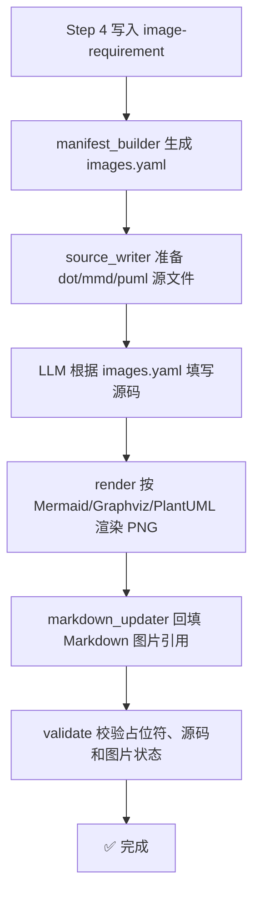

# 图片生成提示词

> 本文件用于指导 AI 在论文写作过程中生成所需的图片资源。

---

## 触发时机

- 用户在 `background.md` 中指定需要生成图片
- 写作过程中识别到适合配图的场景
- 用户明确指令「生成图片」或「为第X章配图」

---

## ER 建模输出机制（配置驱动，非交互）

> [!IMPORTANT]
> E-R 图生成不走逐轮对话确认，统一由 `thesis-workspace/.thesis-config.yaml` 的 `er_modeling` 配置控制。

### 配置项

```yaml
er_modeling:
  enabled: true
  graph_type: dot           # dot | chen | erd
  dot_mode: ""             # "" | textbook-single-entity-ring
  strict_single_table: true
  line_style: straight
  interactive_confirmation: false
  allow_optional_extensions: true
```

> **约束**：只有 E-R 图读取 `er_modeling` 配置；架构图、流程图、模块图、时序图不受该配置影响。

### `graph_type` 映射

- `dot`：Graphviz DOT（默认），采用教科书 Chen 风格：实体矩形、属性椭圆、联系菱形，实体通过联系节点连接实体
- `chen`：按 Graphviz DOT 的 Chen 风格输出
- `erd`：工程 ERD（Mermaid `erDiagram`）

### `dot_mode` 映射

- `""`：继续使用现有默认 DOT 逻辑
- `textbook-single-entity-ring`：仅对 `diagram_type=entity_er` 生效，输出单实体字段环绕图；若同一图片记录中存在 `dot_mode`，则单图配置优先于全局配置

---

## 图片类型与生成策略

### 1. 系统架构图 / 技术架构图

**适用场景**：第4章「系统设计」、第5章「系统实现」

**生成方式**：系统架构图需要用户自行生成；若需要 AI 生成，请使用 GPT image 生图后作为用户图片补入。`scripts/charts/` 图表子系统仅负责保留 `source=user` 占位、校验和回填，不自动生成架构图源码。

**规范**：
- 分层清晰(表现层、接口层、业务层、数据层)
- 图中应体现前端、后端、数据库、外部服务等核心关系
- 标注关键技术名称(如 Vue.js、Spring Boot、MySQL)
- 导出为 PNG 或 SVG 后作为用户图片补入

**示例**：
````markdown
<!-- 图表占位符：图4-1 系统整体架构图 -->
> 📊 **[图表占位符]**
> 展示系统整体架构，包含前端、后端、数据库三层结构
<!-- 图表占位符结束 -->
````

---

### 2. 流程图 / 业务流程图

**适用场景**：第4章「系统设计」、第5章「核心功能实现」

**生成方式**：流程图统一优先使用 PlantUML，由 LLM 根据 `images.yaml` 生成 `.puml` 源码；模块图等非流程型结构图继续优先使用 Mermaid，架构图固定由用户补图

**规范**：
- 起始和结束用圆角矩形 `([开始])` `([结束])`
- 判断/分支用菱形 `{判断条件}`
- 处理步骤用矩形 `[处理步骤]`
- 数据输入/输出用平行四边形 `[数据输入]`
- 连接线标注条件(如 `|成功|` `|失败|`)
- 流程图不要固定为单一方向，可在 `LR`、`RL`、`TB`、`BT` 之间选择
- 避免节点过于密集，必要时拆成多张图或分段展示

**当流程图使用 PlantUML 时，必须附加以下固定提示词模板**：

```text
请生成一个用于毕业论文的PlantUML流程图，主题为“{{图表主题}}”。要求：

- 使用activity diagram
- 所有节点使用中文
- 起止节点使用“开始”“结束”
- 逻辑严谨，体现完整业务流或上下文流转机制
- 包含必要循环（如存在用户持续操作、重试或追问）
- 避免语法歧义（防止被解析为class diagram）
- 图结构简洁，不超过3层嵌套
- 判断分支连线必须明确标注 Y/N
- 全图只保留一个最终结束节点，所有分支和普通路径最终汇入该结束节点
- 适合论文插图展示

只输出PlantUML代码。
```

**补充要求**：
- `{{图表主题}}` 优先替换为 `images.yaml` 的 `title`，必要时可简化为 `purpose`
- 若主题涉及多轮对话、历史会话、审核回退、失败重试等场景，必须在图中体现循环与状态回流
- 模块图等 Mermaid 非流程型结构图不附加上述 PlantUML 提示词；架构图不进入 Mermaid 自动生成链路

---

### 3. 概念 ER 图（Conceptual ER）

**生成策略**：先生成一张总体 ER 图并在数据库设计流程中第一个展示；总体 ER 图只展示实体、联系与 `1:1` / `1:N` 基数，不展示字段，且关系菱形节点必须结合外键字段或实体语义命名，如“拥有”“包含”，不得统一写成“关联”。随后再按需要为核心数据库表生成单表 ER 图。

**模式边界**：
- `diagram_type=overall_er`：只展示实体、联系与基数，不读取 `textbook-single-entity-ring`
- `diagram_type=entity_er`：可通过 `dot_mode=textbook-single-entity-ring` 生成单实体字段环绕 DOT
- 普通 `diagram_type=er`：第一阶段继续沿用现有默认 DOT 逻辑

**适用场景**：第4章「数据库设计」

**生成方式**：由 `.thesis-config.yaml` 的 `er_modeling.graph_type` 决定；仅 E-R 图读取此配置。

**通用规范**：
- 一张图聚焦一个核心实体，可带 1-2 个关联实体
- 主键属性命名统一为 `PK_xxx`，外键属性命名统一为 `FK_xxx`
- 图下方必须有 80-120 字说明，说明实体业务含义、关键属性、与联系语义
- E-R 图在 4.4.1 节，数据表结构在 4.4.2 节，禁止混排
- DOT 输出时不要显式使用 `label=`，直接使用节点文本

**可直接复制生图的描述模板**：
```
图表编号：图4-3
图表名称：用户概念ER图
图表类型：概念ER图
内容描述：
1）实体：用户、角色；
2）用户属性：PK_user_id、用户名、手机号、注册时间、状态；
3）角色属性：PK_role_id、角色名、权限级别；
4）联系：用户-拥有-角色（多对一）；
5）外键：用户实体包含 FK_role_id 指向角色实体主键。
绘图要求：实体用矩形，属性用椭圆，联系用菱形，布局从左到右。
```

**示例**：
每个表一张图：图4-3 用户概念ER图、图4-4 角色概念ER图、图4-5 知识库概念ER图...

---

### 4. 用例图

**适用场景**：第3章「系统总体需求分析」、第4章「系统设计」

**生成方式**：用例图由 LLM 根据 `images.yaml` 需求生成 PlantUML `.puml` 源码，并由 `scripts/charts/render.py` 渲染。生成前必须附加 `source_writer.py` 写入占位文件的固定 PlantUML 用例图提示词。

**布局配置**：由 `thesis-workspace/.thesis-config.yaml` 中的 `usecase_modeling.layout` 控制。
- `overall`：生成一张总体用例图
- `per_actor`：一个角色一张图；`manifest_builder.py` 会把单个占位符展开为多条记录，并在回填时按同一个 `[image_N]` 插入多张图片

**规范**：
- 使用标准 UML 用例图规范
- actor 使用中文
- 系统边界使用 `rectangle` 包裹
- 使用 `left to right direction` 布局
- 风格学术化、简洁、黑白，不使用彩色、渐变、阴影
- 使用 `skinparam shadowing false`、`packageStyle rectangle`、`defaultFontName Microsoft YaHei`
- 仅在确有复用关系时使用 include / extend
- 结合需求描述生成具体角色、具体用例，不使用固定占位模板

---

### 5. 时序图

**适用场景**：第5章「核心功能实现」、接口调用说明

**生成方式**：使用 PlantUML `sequence` 图，由 LLM 根据 `images.yaml` 需求生成 `.puml` 源码并渲染

**规范**：
- 标注参与者(用户、前端、API网关、服务、数据库)
- 请求用 `->>`，返回用 `-->>`
- 自调用用 `A->>A:` 表示内部处理

---

### 6. 系统界面截图(用户提供)

**适用场景**：第5章「系统实现与展示」、第6章「系统测试」

**生成方式**：
- 由用户在真实系统运行后手动截图
- AI 仅负责预留占位符、图注说明与代码讲解配套文本

**规范**：
- 图片尺寸建议 800×600 或 1024×768
- 包含清晰的界面元素(按钮、输入框、表格等)
- 配色简洁专业，符合学术规范
- 每张图片下方标注「图X-X 图片说明」
- 第5章图片来源统一标注为“用户提供(系统实际运行截图)”

---

### 7. 数据可视化图表

**适用场景**：第6章「测试结果分析」、第7章「结论」

**生成方式**：
- 使用 Mermaid `pie`、`gantt` 等图表
- 或使用 Python matplotlib/pyecharts 生成后保存为 PNG

**规范**：
- 数据真实可信，标注数据来源
- 图表标题清晰
- 配色不超过 5 种颜色
- 添加图例说明

---

## 图片生成工作流



---

## 图片存放规范

```
workspace/final/images/
├── sources/
│   ├── image_1.mmd
│   ├── image_2.dot
│   └── image_3.puml
├── image_1.png
├── image_2.png
└── image_3.png
```

**图片清单格式**：`workspace/references/images.yaml` 由 `scripts/charts/manifest_builder.py` 生成，至少包含 `id`、`title`、`chapter`、`section`、`source`、`diagram_type`、`engine`、`purpose`、`fact_source`、`placement`、`status`、`description`、`source_file`、`output_file`、`render_status`。
```yaml
images:
  - id: image_1
    title: 图4-1 系统整体架构图
    chapter: 第4章
    section: "4.1"
    source: user
    diagram_type: architecture
    engine: user
    purpose: 展示系统分层结构
    fact_source: 用户自行生成；如需 AI 生成请使用 GPT image
    placement: 图前说明设计目标，图后解释模块关系
    status: pending_user
    description: 系统架构图由用户自行生成后补入
    output_file: workspace/final/images/image_1.png
    render_status: pending_user
```

---

## 图片质量要求

| 项目 | 要求 |
|------|------|
| 分辨率 | ≥ 300 DPI(打印标准)或 ≥ 72 DPI(电子稿) |
| 格式 | PNG(推荐)或 SVG(矢量图) |
| 背景 | 白色或透明 |
| 文字大小 | 图中文字 ≥ 12pt，确保打印清晰 |
| 配色 | 学术风格，避免过于鲜艳的颜色 |
| 尺寸 | 宽度不超过页面宽度的 80% |

---

## 额外指令：图片生成命令

当用户发送以下指令时，执行对应的图片生成任务：

| 用户指令 | 执行动作 |
|----------|----------|
| 「生成系统架构图」 | 生成 `source=user` 架构图占位与图注说明，提示用户自行制图或使用 GPT image 生图后补入 |
| 「生成流程图」 | 根据业务流程生成 PlantUML 流程图源码文件并渲染 |
| 「生成 E-R 图」 | 根据数据库设计和 `.thesis-config.yaml` 生成对应格式源码文件 |
| 「生成系统截图」 | 提示用户提供真实系统运行截图，并生成对应占位符与图注说明 |
| 「为第X章配图」 | 分析第X章内容，自动生成相关图表 |
| 「生成所有图片」 | 扫描论文中的占位符，批量生成所有图表 |
| 「替换占位符为图片」 | 使用 `scripts/charts/markdown_updater.py` 将 `[image_N]` 回填为 Markdown 图片引用 |

**执行流程**：
1. 解析用户指令，确定图片类型和内容
2. 选择合适的生成方式(PlantUML / Mermaid / Graphviz DOT / 用户提供系统截图 / Python 可视化)
3. AI 图先将图表源码写入 `workspace/final/images/sources/` 下对应 `.puml/.mmd/.dot` 文件；`source=user` 图片不生成源码
4. AI 图再按需渲染并保存到 `workspace/final/images/`；用户图片等待用户补入
5. 更新论文中的图片引用
6. 输出图片生成报告

---

## 与图表工具链的集成

| 工具 | 用途 | 调用时机 |
|------|------|----------|
| `scripts/charts/manifest_builder.py` | 从 `[image_N]` 和 `image-requirement` 生成或更新 `images.yaml` | Step 8 开始 |
| `scripts/charts/source_writer.py` | 创建并校验 `.mmd`、`.dot`、`.puml` 源文件 | LLM 填写源码前后 |
| `scripts/charts/render.py` | 按 Mermaid、Graphviz、PlantUML 渲染 PNG | 源码校验通过后 |
| `scripts/charts/markdown_updater.py` | 将占位符回填为 Markdown 图片引用 | 图片渲染后 |
| `scripts/charts/validate.py` | 校验源码、图片、占位符和用户待补截图状态 | Step 8 完成前 |
| 前端设计 Skill | 生成系统界面设计参考或截图说明 | Step 8 图片生成 |
| Python matplotlib | 生成数据可视化图表 | Step 8 图片生成 |
