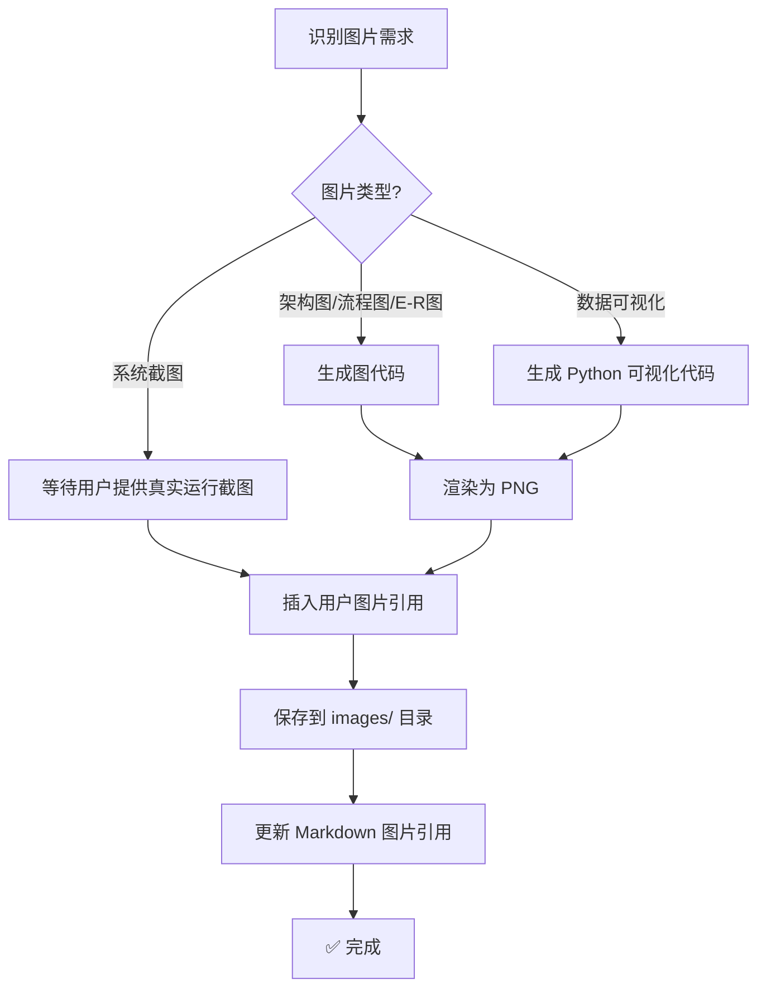

# 图片生成提示词

> 本文件用于指导 AI 在论文写作过程中生成所需的图片资源。

---

## 触发时机

- 用户在 `background.md` 中指定需要生成图片
- 写作过程中识别到适合配图的场景
- 用户明确指令「生成图片」或「为第X章配图」

---

## ER 建模输出机制（配置驱动，非交互）

> [!IMPORTANT]
> E-R 图生成不走逐轮对话确认，统一由 `thesis-workspace/.thesis-config.yaml` 的 `er_modeling` 配置控制。

### 配置项

```yaml
er_modeling:
  enabled: true
  graph_type: chen          # chen | erd | dot
  strict_single_table: true
  line_style: straight
  interactive_confirmation: false
  allow_optional_extensions: true
```

### `graph_type` 映射

- `chen`：概念 ER 图（Mermaid `flowchart LR`，实体矩形/属性椭圆，默认）
- `erd`：工程 ERD（Mermaid `erDiagram`）
- `dot`：Graphviz DOT（输出 `dot` 代码块）

---

## 图片类型与生成策略

### 1. 系统架构图 / 技术架构图

**适用场景**：第4章「系统设计」、第5章「系统实现」

**生成方式**：使用 Mermaid 代码块(通过 `chart_generator.py` + `chart_renderer.py` 渲染)

**规范**：
- 分层清晰(表现层、接口层、业务层、数据层)
- 使用 `graph TB` 自上而下布局
- 每个子系统用 `subgraph` 分组
- 标注关键技术名称(如 Vue.js、Spring Boot、MySQL)

**示例**：
````markdown
<!-- 图表占位符：图4-1 系统整体架构图 -->
> 📊 **[图表占位符]**
> 展示系统整体架构，包含前端、后端、数据库三层结构
<!-- 图表占位符结束 -->
````

---

### 2. 流程图 / 业务流程图

**适用场景**：第4章「功能设计」、第5章「核心功能实现」

**生成方式**：使用 Mermaid `flowchart` 代码块

**规范**：
- 起始和结束用圆角矩形 `([开始])` `([结束])`
- 判断/分支用菱形 `{判断条件}`
- 处理步骤用矩形 `[处理步骤]`
- 数据输入/输出用平行四边形 `[数据输入]`
- 连接线标注条件(如 `|成功|` `|失败|`)

---

### 3. 概念 ER 图（Conceptual ER）

**生成策略**：每个数据库表生成一张独立的 ER 图（默认核心实体单图）

**适用场景**：第4章「数据库设计」

**生成方式**：由 `.thesis-config.yaml` 的 `er_modeling.graph_type` 决定

**通用规范**：
- 一张图聚焦一个核心实体，可带 1-2 个关联实体
- 主键属性命名统一为 `PK_xxx`，外键属性命名统一为 `FK_xxx`
- 图下方必须有 80-120 字说明，说明实体业务含义、关键属性、与联系语义
- E-R 图在 4.4.1 节，数据表结构在 4.4.2 节，禁止混排

**可直接复制生图的描述模板**：
```
图表编号：图4-3
图表名称：用户概念ER图
图表类型：概念ER图
内容描述：
1）实体：用户、角色；
2）用户属性：PK_user_id、用户名、手机号、注册时间、状态；
3）角色属性：PK_role_id、角色名、权限级别；
4）联系：用户-拥有-角色（多对一）；
5）外键：用户实体包含 FK_role_id 指向角色实体主键。
绘图要求：实体用矩形，属性用椭圆，联系用菱形，布局从左到右。
```

**示例**：
每个表一张图：图4-3 用户概念ER图、图4-4 角色概念ER图、图4-5 知识库概念ER图...

---

### 4. 用例图

**适用场景**：第4章「需求分析」、第5章「功能实现」

**生成方式**：使用 Mermaid `graph LR` 模拟用例图

**规范**：
- 角色用圆形 `((用户))`
- 用例用圆形 `((登录))`
- 用 `subgraph 系统` 包裹系统边界
- 连线表示角色与用例的关系

---

### 5. 时序图

**适用场景**：第5章「核心功能实现」、接口调用说明

**生成方式**：使用 Mermaid `sequenceDiagram` 代码块

**规范**：
- 标注参与者(用户、前端、API网关、服务、数据库)
- 请求用 `->>`，返回用 `-->>`
- 自调用用 `A->>A:` 表示内部处理

---

### 6. 系统界面截图(用户提供)

**适用场景**：第5章「系统实现与展示」、第6章「系统测试」

**生成方式**：
- 由用户在真实系统运行后手动截图
- AI 仅负责预留占位符、图注说明与代码讲解配套文本

**规范**：
- 图片尺寸建议 800×600 或 1024×768
- 包含清晰的界面元素(按钮、输入框、表格等)
- 配色简洁专业，符合学术规范
- 每张图片下方标注「图X-X 图片说明」
- 第5章图片来源统一标注为“用户提供(系统实际运行截图)”

---

### 7. 数据可视化图表

**适用场景**：第6章「测试结果分析」、第7章「结论」

**生成方式**：
- 使用 Mermaid `pie`、`gantt` 等图表
- 或使用 Python matplotlib/pyecharts 生成后保存为 PNG

**规范**：
- 数据真实可信，标注数据来源
- 图表标题清晰
- 配色不超过 5 种颜色
- 添加图例说明

---

## 图片生成工作流



---

## 图片存放规范

```
workspace/final/images/
├── 图4-1 系统架构图.png
├── 图4-2 用户注册流程图.png
├── 图4-3 数据库E-R图.png
├── 图5-1 用户登录界面.png
├── 图5-2 数据管理界面.png
└── image_manifest.md          # 图片清单文件
```

**image_manifest.md 格式**：
```markdown
# 论文图片清单

| 图号 | 文件名 | 说明 | 生成方式 |
|------|--------|------|----------|
| 图4-1 | 图4-1 系统架构图.png | 系统整体架构 | Mermaid 渲染 |
| 图4-2 | 图4-2 用户注册流程图.png | 用户注册业务流程 | Mermaid 渲染 |
| 图5-1 | 图5-1 用户登录界面.png | 登录功能界面 | 用户提供系统截图 |
```

---

## 图片质量要求

| 项目 | 要求 |
|------|------|
| 分辨率 | ≥ 300 DPI(打印标准)或 ≥ 72 DPI(电子稿) |
| 格式 | PNG(推荐)或 SVG(矢量图) |
| 背景 | 白色或透明 |
| 文字大小 | 图中文字 ≥ 12pt，确保打印清晰 |
| 配色 | 学术风格，避免过于鲜艳的颜色 |
| 尺寸 | 宽度不超过页面宽度的 80% |

---

## 额外指令：图片生成命令

当用户发送以下指令时，执行对应的图片生成任务：

| 用户指令 | 执行动作 |
|----------|----------|
| 「生成系统架构图」 | 根据系统描述生成 Mermaid 架构图代码并渲染 |
| 「生成流程图」 | 根据业务流程生成 Mermaid 流程图代码并渲染 |
| 「生成 E-R 图」 | 根据数据库设计和 `.thesis-config.yaml` 生成对应格式图 |
| 「生成系统截图」 | 提示用户提供真实系统运行截图，并生成对应占位符与图注说明 |
| 「为第X章配图」 | 分析第X章内容，自动生成相关图表 |
| 「生成所有图片」 | 扫描论文中的占位符，批量生成所有图表 |
| 「替换占位符为图片」 | 将 `<!-- 图表占位符 -->` 替换为实际图片 |

**执行流程**：
1. 解析用户指令，确定图片类型和内容
2. 选择合适的生成方式(Mermaid / Graphviz DOT / 用户提供系统截图 / Python 可视化)
3. 生成图片并保存到 `workspace/final/images/`
4. 更新论文中的图片引用
5. 输出图片生成报告

---

## 与图表工具链的集成

| 工具 | 用途 | 调用时机 |
|------|------|----------|
| `chart_generator.py` | 从占位符生成图代码（受 `.thesis-config.yaml` 控制） | Step 4 写作后 |
| `chart_renderer.py` | 将 Mermaid 渲染为 PNG | Step 9 图表渲染 |
| 前端设计 Skill | 生成系统界面设计图 | Step 8 图片生成 |
| Python matplotlib | 生成数据可视化图表 | Step 8 图片生成 |
