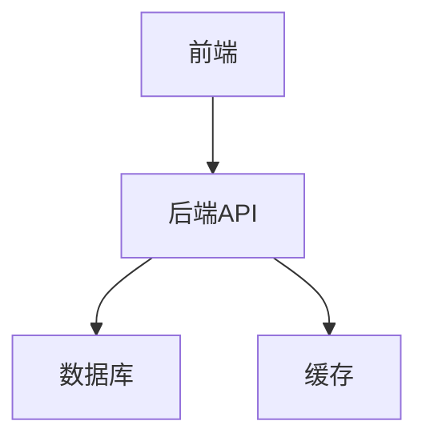

# 代码技术栈总结

> 本文件由 thesis-creator 自动生成，用于在撰写第4章（系统设计）和第5章（系统实现）时提供技术上下文。
> 生成时间：YYYY-MM-DD HH:MM:SS

---

## 一、技术栈清单

### 前端技术栈

| 技术 | 版本 | 用途 |
|------|------|------|
| React | x.x | 前端框架 |
| TypeScript | x.x | 类型安全 |
| （其他） | | |

### 后端技术栈

| 技术 | 版本 | 用途 |
|------|------|------|
| Java/Spring Boot | x.x | 后端框架 |
| Redis | x.x | 缓存 |
| PostgreSQL | x.x | 数据库 |
| MinIO | x.x | 文件存储 |
| Elasticsearch | x.x | 搜索引擎 |
| Neo4j | x.x | 图数据库 |
| （其他） | | |

---

## 二、核心模块

### 模块清单

| 模块名称 | 职责描述 | 关键文件 |
|----------|----------|----------|
| （模块1） | （职责） | （文件路径） |
| （模块2） | （职责） | （文件路径） |

### 模块关系图



---

## 三、关键接口

### API 端点清单

| 接口路径 | 方法 | 功能描述 |
|----------|------|----------|
| `/api/v1/xxx` | GET | （功能） |
| `/api/v1/xxx` | POST | （功能） |

### 数据流说明

（描述主要数据流向和处理逻辑）

---

## 四、代码片段

> ⚠️ 注意：论文中引用的代码片段不得超过 20 行

### 片段 1：（名称）

```java
// 文件路径：（源文件）
// 功能：（功能说明）
（代码内容，≤20行）
```

**设计说明**：（简要说明设计思路）

**效果分析**：（说明该代码实现的效果）

### 片段 2：（名称）

```java
// 文件路径：（源文件）
// 功能：（功能说明）
（代码内容，≤20行）
```

**设计说明**：（简要说明设计思路）

**效果分析**：（说明该代码实现的效果）

---

## 五、外部项目引用

> 如果 code 文件夹中包含外部项目引用，在此记录

| 项目路径 | 项目类型 | 关键内容 |
|----------|----------|----------|
| `E:\IdeaProjects\SpringBoot\know-hub` | Spring Boot | 知识库管理系统 |

### 外部项目摘要

（对外部项目的核心结构和技术实现进行简要总结）

---

## 六、论文引用指南

### 第4章 系统设计引用示例

> "本系统采用 **React + TypeScript** 作为前端技术栈，配合 **Spring Boot + PostgreSQL** 后端架构，实现了前后端分离的 Web 应用..."

### 第5章 系统实现引用示例

> 核心业务逻辑实现代码如下（见片段1），通过 xxx 方法实现了 xxx 功能...

---

*此总结由 thesis-creator Step 2 自动生成*