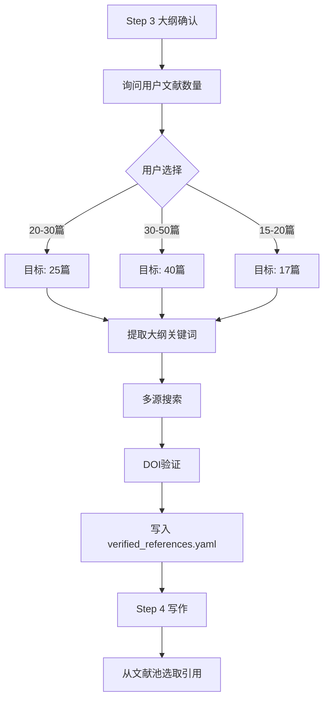

# 参考文献 workflow

> **单独存放，按需生成**

---

## 核心原则

1. **文献池独立存放**：`workspace/verified_references.yaml`
2. **写作前生成文献池**：确保引用来源真实可靠
3. **默认数量 20-30 篇**：适合标准本科论文

---

## 流程概览



---

## 用户交互

### Step 3 大纲确认后询问文献数量

```json
{
  "questions": [
    {
      "header": "文献数量",
      "question": "大纲已生成，请选择参考文献数量需求：",
      "multiSelect": false,
      "options": [
        {
          "label": "20-30 篇（推荐）",
          "description": "标准本科论文参考文献数量，适合大多数情况。",
          "markdown": "📚 标准本科论文配置\n✅ 适合大多数学科\n⏱️ 搜索时间适中"
        },
        {
          "label": "30-50 篇",
          "description": "文献综述较多或研究深入的论文。",
          "markdown": "📚 研究型论文配置\n✅ 更全面的文献覆盖\n⏱️ 搜索时间较长"
        },
        {
          "label": "15-20 篇",
          "description": "研究范围较小或文献资源有限。",
          "markdown": "📚 轻量配置\n✅ 快速完成\n⏱️ 搜索时间较短"
        }
      ]
    }
  ]
}
```

---

## 文献池格式

`workspace/verified_references.yaml`：

```yaml
# 已验证的真实文献池
pool_id: thesis_references
generated_at: 2026-04-13
total: 25

references:
  - id: ref_001
    title: "Retrieval-Augmented Generation for Knowledge-Intensive NLP Tasks"
    authors: ["Lewis P", "Perez E", "Piktus A"]
    year: 2020
    doi: "10.18653/v1/2020.naacl-main.13"
    doi_url: "https://doi.org/10.18653/v1/2020.naacl-main.13"
    verified: true
    cross_verified: true
    source: "Semantic Scholar"
    citation_count: 1200
    relevance_score: 0.85
    keywords: ["RAG", "knowledge-intensive", "NLP"]
    gb7714: "[1] Lewis P, Perez E, Piktus A, et al. Retrieval-Augmented Generation for Knowledge-Intensive NLP Tasks[C]//NAACL 2020. 2020. [DOI](https://doi.org/10.18653/v1/2020.naacl-main.13)"
```

---

## 引用规则

| 规则 | 说明 | 违规处理 |
|------|------|----------|
| 只引用已验证文献 | 所有引用必须来自文献池 | 自动标记为「未验证」，触发重生成 |
| 禁止编造标题 | 不能虚构论文标题 | 触发重生成 |
| 禁止编造作者 | 不能虚构作者名 | 触发重生成 |
| 禁止编造 DOI | 不能虚构 DOI 号 | 触发重生成 |
| 必须包含 DOI 链接 | 格式：[DOI](https://doi.org/xxx) | 自动补充或标记 |
| **数量严格控制** | 最终参考文献不得超出用户选择的上限 | 合并时按相关度截取 |

### 数量控制规则

| 用户选择 | 文献池搜索数量 | 最终参考文献上限 | 允许范围 |
|---------|--------------|----------------|---------|
| 20-30 篇 | 搜索 35 篇 | 30 篇 | 15-35 篇 |
| 30-50 篇 | 搜索 55 篇 | 50 篇 | 25-55 篇 |
| 15-20 篇 | 搜索 25 篇 | 20 篇 | 10-25 篇 |

> **截取规则**：如实际引用数量超出上限，按 `relevance_score`（相关度）排序后截取。合并脚本会自动处理。

---

## DOI 验证逻辑

> **判断 4xx 错误状态码**

```python
def check_doi_reachable(doi: str) -> bool:
    """
    检查DOI链接可达性

    返回值：
    - True: 链接可达（状态码 < 400）
    - False: 链接不可达（4xx 或 5xx 错误）
    """
    try:
        response = requests.head(
            f"https://doi.org/{doi}",
            timeout=10,
            allow_redirects=True
        )
        # 判断 4xx 和 5xx 错误
        if 400 <= response.status_code < 600:
            return False  # DOI 不存在或不可达
        return True  # 链接正常
    except:
        return False
```

---

## 命令速查

```bash
# 搜索并验证文献
python scripts/reference_engine.py --query "关键词" --limit 25 --verify-doi -o workspace/verified_references.yaml

# 验证单个 DOI
python scripts/reference_engine.py --doi "10.xxx/yyy" --verify-doi

# 导出 GB/T 7714 格式
python scripts/reference_engine.py --query "关键词" --format gbt7714 -o workspace/references.md
```