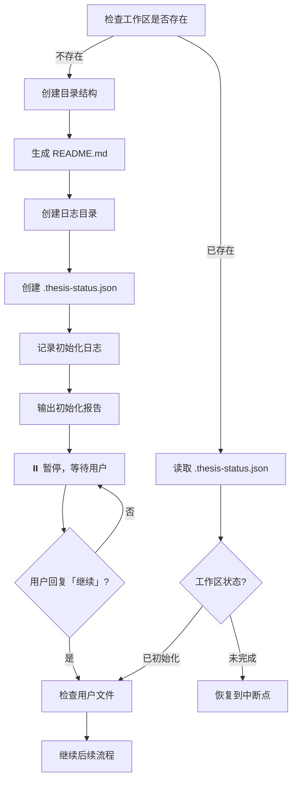

# Step 0: 工作区初始化

**触发**：
- 「初始化工作区」
- 或首次执行「帮我写论文」时自动触发

---

## 执行流程



---

## 详细步骤

### 1. 检查工作区

- 检查 `<用户项目目录>/thesis-workspace/` 是否存在
- 读取 `.thesis-status.json` 判断当前状态

### 2. 创建工作区（如不存在）

- 创建完整目录结构
- 生成 `README.md` 使用说明
- 创建 `logs/` 目录
- 复制模板文件：
  - `references/prompt/background_template.md` → `references/prompt/background.md`
- 初始化 `.thesis-status.json`

### 3. 记录日志

- 创建日志目录：`logs/YYYYMMDD_HHMMSS/`
- 写入 `step_0_init.log`：记录初始化详情
- 更新 `logs/latest` 软链接

### 4. 输出初始化报告并暂停

```
✅ 工作区初始化完成！

📂 工作区位置：thesis-workspace/
📝 日志目录：thesis-workspace/logs/latest/

📋 请按以下步骤准备参考资料：

1. 打开 thesis-workspace/README.md 阅读详细说明
2. 将学校模板放入 references/templates/
3. 将优秀范文放入 references/examples/
4. 将写作规范放入 references/guidelines/
5. 填写 references/prompt/background.md（必填）
6. 将参考文献放入 references/reference/doc/
7. 将参考代码放入 references/reference/code/

⏸️ 准备完成后，请回复「继续」开始论文创作。
```

### 5. 等待用户确认

- 用户回复「继续」后，检查文件准备情况
- 输出文件检查报告
- 继续后续流程

---

## 防呆机制

- 目录已存在 → 询问是否重置
- 文件已存在 → 保留用户版本，不覆盖

---

## 状态记录

`.thesis-status.json` 格式：

```json
{
  "version": "1.0",
  "status": "initialized",
  "created_at": "2026-03-06T15:00:00",
  "current_step": 0,
  "steps_completed": ["initialization"],
  "warnings": [],
  "last_updated": "2026-03-06T15:00:00"
}
```