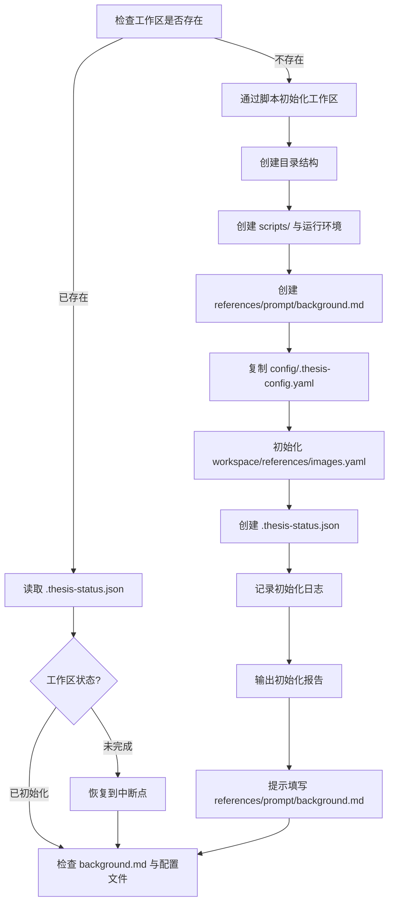

# Step 0: 工作区初始化

> **状态管理(强制执行)**：
> 1. 启动前：`python scripts/core/status_manager.py thesis-workspace/ --ensure`
> 2. 本步骤启动时执行：`python scripts/core/status_manager.py thesis-workspace/ --init`
> 3. 完成后执行：`python scripts/core/status_manager.py thesis-workspace/ --update-step 0 --action complete`
>
> **统一入口(推荐)**：`python scripts/core/lifecycle.py --workspace thesis-workspace/ --step 0 --event start|complete`

**触发**：
- 「初始化工作区」
- 或首次执行「帮我写论文」时自动触发

---

## 执行流程



---

## 详细步骤

### 1. 检查工作区

- 检查 `<用户项目目录>/thesis-workspace/` 是否存在
- 读取 `.thesis-status.json` 判断当前状态

### 2. 创建工作区(如不存在)

- 工作区不存在时，必须通过脚本初始化工作区，禁止大模型手工拼接目录
- 推荐命令：`python scripts/core/lifecycle.py --workspace thesis-workspace/ --prepare-runtime`
- 初始化完成后必须执行预检：`python scripts/core/lifecycle.py --workspace thesis-workspace/ --check-workspace`
- 预检必须覆盖 `scripts/`、`logs/`、`.thesis-status.json`、`.thesis-config.yaml`、`references/prompt/background.md`、`workspace/references/images.yaml`
- 预检必须覆盖运行脚本子模块，例如 `scripts/charts/render.py`、`scripts/charts/source_writer.py`、`scripts/charts/engines/plantuml.py`、`scripts/charts/engines/graphviz.py`、`scripts/references/reference_engine.py`、`scripts/aigc/detect.py`
- 自动创建完整目录结构，包括 `workspace/drafts`、`workspace/final`、`workspace/final/images`、`workspace/final/images/sources`、`workspace/reports`、`workspace/references`
- 自动创建 `scripts/` 目录、运行环境与完整运行脚本模块
- 自动生成 `README.md` 使用说明
- 自动创建 `logs/` 目录
- 复制模板文件：
  - `references/prompt/background_template.md` → `references/prompt/background.md`
  - `config/.thesis-config.yaml` → `.thesis-config.yaml`
- 初始化 `workspace/references/images.yaml`（结构化图片需求清单）
- 初始化 `.thesis-status.json`

### 3. 记录日志

- 创建日志目录：`logs/YYYYMMDD_HHMMSS/`
- 写入 `step_0_init.log`：记录初始化详情
- 更新 `logs/latest` 软链接

### 4. 输出初始化报告

```
✅ 工作区初始化完成！

📂 工作区位置：thesis-workspace/
📝 日志目录：thesis-workspace/logs/latest/

📋 请先完成以下准备：

1. 打开 thesis-workspace/README.md 阅读详细说明
2. 将学校模板放入 references/templates/
3. 将优秀范文放入 references/examples/
4. 将写作规范放入 references/guidelines/
5. 填写 references/prompt/background.md（必填）
6. 将参考文献放入 references/reference/doc/
7. 确认 `thesis-workspace/.thesis-config.yaml` 已从 `config/.thesis-config.yaml` 复制生成，并按学校要求修改
8. 确认 `thesis-workspace/workspace/references/images.yaml` 已生成
9. 确认 `thesis-workspace/scripts/charts/render.py` 等脚本子模块已生成
10. 确认 `thesis-workspace/workspace/final/images/sources`、`workspace/drafts`、`workspace/reports` 已生成

⏸️ 请先填写 references/prompt/background.md，再回复「继续」开始论文创作。
```

### 5. 等待用户确认

- 用户回复「继续」后，先检查 `thesis-workspace/references/prompt/background.md`
- 校验规则(全部通过才可继续)：
  - 文件存在
  - 文件大小 > 100 字节
  - 不包含模板占位内容(如 `请填写以下信息`、`(描述研究领域的现状和问题)`)
- 若不通过：
  - 自动创建 `thesis-workspace/references/prompt/background.md`(来源：`references/prompt/background_template.md`)
  - 明确提示用户填写 references/prompt/background.md 后再次回复「继续」
  - **禁止在控制台进行交互式输入采集背景信息**
- 通过后输出文件检查报告并继续后续流程

---

## 防呆机制

- 目录已存在 → 询问是否重置
- 文件已存在 → 保留用户版本，不覆盖

---

## 模板包加载规则

Step 0 初始化时必须完成以下动作：

1. 读取 `thesis-workspace/.thesis-config.yaml` 中的 `thesis.discipline` 与 `thesis.mode`。
2. 未指定时默认使用：
   - `discipline: cs_se`
   - `mode: undergraduate`
3. 加载 skill 内置模板包：
   - `packages/base/`
   - `packages/disciplines/{discipline}/`
   - `packages/modes/{mode}.yaml`
4. 按优先级合并配置：

`用户覆盖 > 学科模板 > 模式模板 > 基础模板 > 系统默认`

5. 输出运行时配置到：

`thesis-workspace/.thesis-runtime-config.yaml`

如果模板包缺少 `manifest.yaml` 或必填文件，必须停止流程并提示用户修复模板包，禁止继续进入 Step 3。

### 内置可用学科包

| `discipline` 取值 | 学科名称 | 章节结构 | 适用专业举例 |
|-------------------|----------|----------|--------------|
| `cs_se` | 计算机科学与软件工程 | 7 章 | 计算机科学、软件工程、网络工程、信息安全、人工智能、数据科学 |
| `business_management` | 经济管理 | 5 章 | 工商管理、市场营销、财务管理、人力资源、电子商务、物流管理、旅游管理、公共管理、经济学 |
| `law` | 法学 | 6 章 | 民商法、经济法、刑法、行政法、宪法、诉讼法、国际法、知识产权法 |
| `education` | 教育学 | 6 章 | 教育学原理、课程与教学论、学前教育、特殊教育、教育技术、高等教育 |
| `humanities` | 人文学科 | 5 章 | 中国语言文学、外国语言文学、历史学、哲学、考古学、宗教学 |
| `medical_nursing` | 医学与护理学 | 6 章（IMRaD 扩展）| 临床医学、基础医学、护理学、预防医学、药学、口腔医学、中医学、康复医学 |
| `engineering` | 工科（非软件）| 7 章 | 机械工程、电气工程、土木工程、化学工程、材料科学、能源动力、自动化、仪器仪表、交通运输 |
| `science` | 理科 | 6 章（IMRaD）| 数学、应用数学、统计学、物理学、化学、生物学、地理学、地质学、生态学、环境科学 |
| `art_design` | 艺术与设计 | 6 章（含作品）| 视觉传达、产品设计、环境艺术、数字媒体、动画、服装设计、工业设计、UI/UX、绘画、雕塑 |
| `base` | 通用基础模板 | 4 章 | 兜底；无匹配学科时使用，须由用户在 `.thesis-config.yaml` 内联补充字段 |

### 选择学科的快速决策树

```
项目交付物是软件系统？
├─ 是 → cs_se
└─ 否 ↓
   涉及实体产品或物理工程？
   ├─ 是 → engineering（机械/土木/化工…）或 art_design（设计作品）
   └─ 否 ↓
      涉及临床/护理/药学/医学实验？
      ├─ 是 → medical_nursing
      └─ 否 ↓
         核心方法是数学推导/物理实验/化学实验/生物实验？
         ├─ 是 → science
         └─ 否 ↓
            涉及法律规范分析与案例？
            ├─ 是 → law
            └─ 否 ↓
               涉及教学/学习/课程/学生？
               ├─ 是 → education
               └─ 否 ↓
                  以文本/史料/概念分析为核心？
                  ├─ 是 → humanities
                  └─ 否 → business_management（管理学/经济学）
```

> 拿不准时优先用 `base`，再在 `.thesis-config.yaml` 中按需要覆盖字段；
> 学科判断错会导致全部章节结构和图表偏好与学校要求严重不符。

---

## 状态记录

`.thesis-status.json` 格式：

```json
{
  "version": "2.0",
  "created_at": "2026-03-06T15:00:00",
  "updated_at": "2026-03-06T15:00:00",
  "current_step": 0,
  "steps": {
    "0": {"name": "初始化", "status": "completed"}
  },
  "chapter_status": {},
  "references_status": {
    "pool_created": false,
    "pool_path": "",
    "total_refs": 0,
    "zh_ratio": 0.0
  }
}
```
