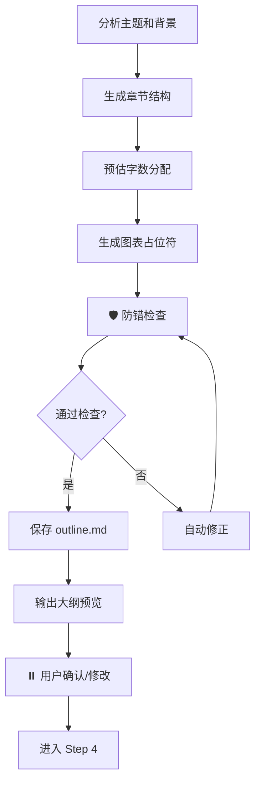

# Step 3: 生成论文大纲

> **加载 Prompt**：`prompts/thesis_structure.md`

---

## 执行流程

---

## 防错检查（自动执行）

| 检查项 | 要求 | 不达标处理 |
|--------|------|-----------|
| 规定动作章节 | 必须包含：绪论、国内外研究现状、可行性分析、结论 | 自动补充缺失章节 |
| 设计实现分离 | 第4章设计、第5章实现，不可合并 | 强制拆分 |
| 篇幅比例 | 正文各章字数合理分配 | 提示建议比例 |

---

## 输出文件

- `workspace/outline.md` - 论文大纲