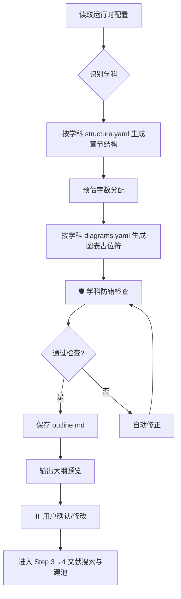

# Step 3: 生成论文大纲

> **状态管理(强制执行)**：
> 1. 启动前：`python scripts/core/status_manager.py thesis-workspace/ --ensure`
> 2. 启动时：`python scripts/core/status_manager.py thesis-workspace/ --check-step 3`
> 3. 前置条件通过后：`--update-step 3 --action start`
> 4. 完成后：`--update-step 3 --action complete`
>
> **统一入口(推荐)**：`python scripts/core/lifecycle.py --workspace thesis-workspace/ --step 3 --event start|complete`

> **加载 Prompt**：`prompts/thesis_structure.md` + 当前学科 `packages/disciplines/{discipline}/prompts/writer.md`

---

## 执行流程

---

## 配置驱动大纲生成（硬约束）

> **大纲结构必须来自学科模板，禁止硬编码章节。**
> 不同学科有不同的章节数、核心章节、图表要求，必须按 `.thesis-runtime-config.yaml` 生成。

生成大纲时，必须读取：

`thesis-workspace/.thesis-runtime-config.yaml`

大纲来源优先级：

1. 用户覆盖层中的自定义结构
2. 学科模板 `structure.yaml`
3. 基础模板 `structure.yaml`（4 章兜底）

### 各学科默认章节结构

| 学科 (`discipline`) | 章节数 | 章节结构 |
|---------------------|--------|----------|
| `cs_se` | 7 | 绪论→关键技术→需求分析→系统设计→系统实现→系统测试→总结与展望 |
| `business_management` | 5 | 绪论→相关理论与文献综述→研究设计→实证/案例分析→研究结论与建议 |
| `law` | 6 | 引言→基本理论概述→现状考察与案例分析→问题与原因分析→完善建议→结语 |
| `education` | 6 | 绪论→文献综述与理论基础→研究设计与方法→调查或实验结果分析→讨论与教育对策→结论与反思 |
| `humanities` | 5 | 绪论→文献综述与研究述评→文本/史料/概念分析→深度阐释与论证→结论与价值 |
| `medical_nursing` | 6 | 前言→文献综述→研究对象与方法→研究结果→讨论→结论与展望 |
| `engineering` | 7 | 绪论→相关理论与技术基础→总体方案与原理设计→详细设计与建模→仿真或实验分析→结果讨论与优化→结论与展望 |
| `science` | 6 | 引言→理论基础与文献综述→研究方法与材料→实验/计算/推导结果→讨论与机理分析→结论与展望 |
| `art_design` | 6 | 绪论→设计调研与案例分析→设计定位与概念→设计方案与表现→作品阐释与设计反思→结语 |
| `base` | 4 | 绪论→理论基础与相关研究→研究设计与分析→结论与展望 |

> 非本学科特征要求不得强加：如经管类不要求代码/截图/数据库表；法学类不要求图表；艺术设计类要求大量作品图但禁止 ER 图。
> 具体差异详见 `step_0_init.md` "内置可用学科包" 与各学科 `prompts/writer.md`。

---

## 学科防错检查（自动执行）

> **按学科模板的 `checklist.yaml` + `structure.yaml` 自动校验，不套用其他学科规则。**

### 通用检查（所有学科）

| 检查项 | 要求 | 不达标处理 |
|--------|------|-----------|
| 章节完整性 | 必须包含 `structure.yaml` 声明的全部 `required: true` 章节 | 强制补充 |
| 图表编号格式 | 图X-X(短横线)、表X.X(句点) | 修正 |
| 篇幅比例 | 各章字数合理分配 | 提示建议比例 |
| 大纲与结构模板一致 | outline.md 的章节数与 `structure.yaml` 匹配 | 自动对齐 |

### CS/SE 学科专属检查（discipline=cs_se 时才执行）

| 检查项 | 要求 | 不达标处理 |
|--------|------|-----------|
| 七章制结构 | 绪论→关键技术→需求分析→系统设计→系统实现→系统测试→总结与展望 | 强制调整 |
| 规定动作章节 | 必须包含：国内外研究现状、可行性分析、开发环境表、测试用例表 | 自动补充 |
| 章节顺序 | 需求分析(含可行性)→系统设计→系统实现→系统测试 | 强制调整 |
| 设计实现分离 | 系统设计与系统实现不可合并 | 强制拆分 |
| 必备图表 | 需求分析用例图、系统设计模块图+E-R图+流程图、系统实现截图、系统测试测试用例表 | 补充占位符 |
| 模块→流程顺序 | 先模块划分后流程描述 | 重组 |
| 数据库表数量 | 系统设计章节 ≥11 张表结构 | 检查 background.md 表定义 |

### 经管学科专属检查（discipline=business_management 时才执行）

| 检查项 | 要求 | 不达标处理 |
|--------|------|-----------|
| 研究方法明确 | 第3章说明研究方法（案例/实证/规范分析） | 提示补充 |
| 变量/数据来源 | 实证类须含变量定义表与数据来源说明 | 提示补充 |
| 无技术用语 | 不出现"系统设计/实现/测试/数据库/接口" | 强制替换 |
| 建议分层 | 第5章按战略/管理/执行或短/中/长分层 | 提示补充 |

### 法学学科专属检查（discipline=law 时才执行）

| 检查项 | 要求 | 不达标处理 |
|--------|------|-----------|
| 法条依据 | 核心章节有法条/司法解释/指导案例安排 | 提示补充 |
| 案例安排 | 第3章含典型案例分析占位 | 提示补充 |
| 建议回应问题 | 第5章完善建议回应第4章问题 | 提示补充 |
| 无技术用语 | 不出现"系统设计/数据库/接口" | 强制替换 |

### 教育学专属检查（discipline=education）

| 检查项 | 要求 | 不达标处理 |
|--------|------|-----------|
| 理论框架 | 第2章含理论框架图占位 | 补充 |
| 研究方法 | 第3章说明研究方法与数据收集 | 提示补充 |
| 教育对策 | 第5章按教师/学校/课程/政策分层 | 提示补充 |

### 人文学科专属检查（discipline=humanities）

| 检查项 | 要求 | 不达标处理 |
|--------|------|-----------|
| 一手材料 | 第3-4章含原典/史料/外文原文引用安排 | 提示补充 |
| 无实证/技术用语 | 不出现"实证检验/系统设计/数据库" | 强制替换 |

### 医学/护理学专属检查（discipline=medical_nursing）

| 检查项 | 要求 | 不达标处理 |
|--------|------|-----------|
| 伦理审批 | 第3章含伦理审批号与知情同意说明占位 | 强制补充 |
| 纳入/排除标准 | 第3章含纳入与排除标准 | 强制补充 |
| 报告规范 | 按研究设计声明遵循 CONSORT/STROBE/PRISMA/COREQ/STARD | 强制补充 |
| 结果与讨论分离 | 第4章只陈述结果，第5章讨论解读 | 强制拆分 |

### 工科专属检查（discipline=engineering）

| 检查项 | 要求 | 不达标处理 |
|--------|------|-----------|
| 方案/设计/验证分章 | 总体方案→详细设计→仿真/实验，不可合并 | 强制拆分 |
| 仿真或实验 | 第5章含仿真/实验安排 | 提示补充 |
| 误差分析 | 第5-6章含误差/不确定度分析占位 | 提示补充 |
| 物理量单位 | 公式变量注明单位 | 提示补充 |

### 理科专属检查（discipline=science）

| 检查项 | 要求 | 不达标处理 |
|--------|------|-----------|
| 公式编号 | 公式右侧标(X-X)，正文必须引用 | 提示补充 |
| 误差棒 | 实验数据图含误差棒/置信区间占位 | 提示补充 |
| 对照组 | 生物/化学实验含对照安排 | 提示补充 |

### 艺术设计专属检查（discipline=art_design）

| 检查项 | 要求 | 不达标处理 |
|--------|------|-----------|
| 设计作品 | 第4章含大量设计图占位（≥5 张） | 强制补充 |
| 设计方法论 | 第3章声明设计方法（UCD/HCD/双钻） | 提示补充 |
| 目标用户 | 明确设计的目标用户与使用场景 | 提示补充 |
| 无技术用语 | 不出现"数据库/接口实现/系统测试" | 强制替换 |

---

## 结构校验环节（自动执行）

> 生成大纲后，自动执行以下校验：

1. **章节完整性校验**：检查是否包含学科 `structure.yaml` 声明的全部 `required: true` 章节
2. **核心章节校验**：`is_core_chapter: true` 的章节须有 ≥3 个子节
3. **图表占位符校验**：按学科 `diagrams.yaml` 检查必备图表是否已安排占位符
4. **编号格式校验**：检查图表编号是否符合统一格式
5. **学科禁用词校验**：大纲中不得出现该学科 `writing_rules.yaml` 中 `language.forbid_terms` 的词汇

校验不通过时自动修正并重新校验，最多3轮。

---

## 输出文件

- `workspace/outline.md` - 论文大纲(含图表占位符和字数预估)
