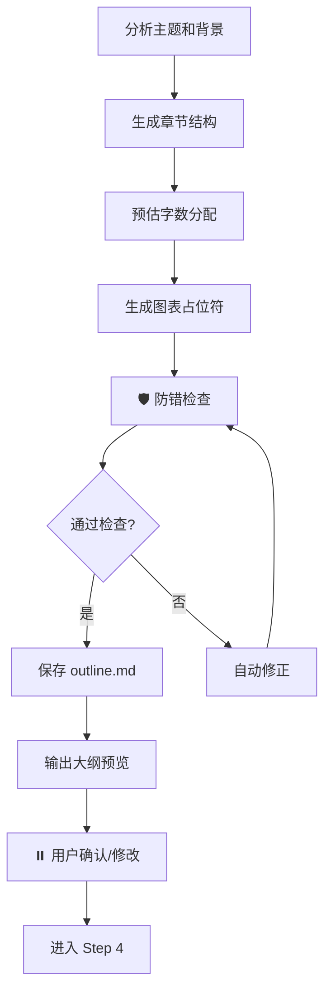

# Step 3: 生成论文大纲

> **状态管理（强制执行）**：
> 1. 启动前：`python scripts/status_manager.py thesis-workspace/ --ensure`
> 2. 启动时：`python scripts/status_manager.py thesis-workspace/ --check-step 3`
> 3. 前置条件通过后：`--update-step 3 --action start`
> 4. 完成后：`--update-step 3 --action complete`
>
> **统一入口（推荐）**：`python scripts/lifecycle.py --workspace thesis-workspace/ --step 3 --event start|complete`

> **加载 Prompt**：`prompts/thesis_structure.md`

---

## 执行流程

---

## 防错检查（自动执行）

| 检查项 | 要求 | 不达标处理 |
|--------|------|-----------|
| 七章制结构 | 必须为7章：绪论→关键技术→需求分析→系统设计→系统实现→系统测试→总结与展望 | 强制调整 |
| 规定动作章节 | 必须包含：国内外研究现状、可行性分析、开发环境表、测试用例表 | 自动补充缺失章节 |
| 章节顺序 | 第3章需求分析（含可行性）→ 第4章系统设计 → 第5章系统实现 → 第6章系统测试 | 强制调整 |
| 设计实现分离 | 第4章设计、第5章实现，不可合并 | 强制拆分 |
| 必备子节 | 每章必备子节参照 thesis_structure.md | 自动补充 |
| 必备图表 | 第3章用例图、第4章模块图+E-R图+流程图、第5章截图、第6章测试用例表 | 补充占位符 |
| 模块→流程顺序 | 第3-5章先模块划分后流程描述 | 重组 |
| 篇幅比例 | 正文各章字数合理分配 | 提示建议比例 |
| 图表编号格式 | 图X-X（短横线）、表X.X（句点） | 修正 |

---

## 结构校验环节（自动执行）

> 生成大纲后，自动执行以下校验：

1. **章节完整性校验**：检查是否包含所有7章
2. **子节完整性校验**：检查每章是否包含必备子节
3. **图表占位符校验**：检查必备图表是否已安排占位符
4. **编号格式校验**：检查图表编号是否符合统一格式

校验不通过时自动修正并重新校验，最多3轮。

---

## 输出文件

- `workspace/outline.md` - 论文大纲（含图表占位符和字数预估）

