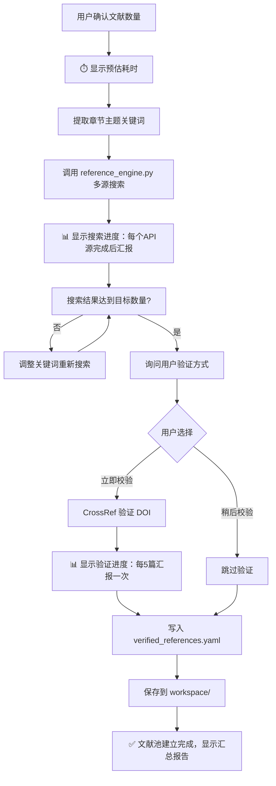

# Step 4: 分章节撰写

> **⚠️ 强制前置：文献搜索验证**
> 在开始写作前，必须先搜索真实文献建立"文献池"，AI 只能从池中引用，禁止编造。

---

## 4.0 前置文献搜索流程（强制执行）

### 用户交互：询问文献数量

```json
{
  "questions": [
    {
      "header": "文献数量",
      "question": "请选择参考文献数量需求：",
      "multiSelect": false,
      "options": [
        {
          "label": "20-30 篇（推荐）",
          "description": "标准本科论文参考文献数量，适合大多数情况。",
          "markdown": "📚 标准本科论文配置\n✅ 适合大多数学科\n⏱️ 搜索时间适中"
        },
        {
          "label": "30-50 篇",
          "description": "文献综述较多或研究深入的论文。",
          "markdown": "📚 研究型论文配置\n✅ 更全面的文献覆盖\n⏱️ 搜索时间较长"
        },
        {
          "label": "15-20 篇",
          "description": "研究范围较小或文献资源有限。",
          "markdown": "📚 轻量配置\n✅ 快速完成\n⏱️ 搜索时间较短"
        }
      ]
    }
  ]
}
```

### 搜索与验证流程



### 耗时预估提示（搜索前必须显示）

在开始搜索前，向用户显示以下预估信息：

```
📚 文献搜索即将开始！

⏱️ 预估耗时：
   - 搜索阶段：约 2-5 分钟（3个API源并行查询）
   - DOI验证阶段：约 3-8 分钟（逐条验证，每条约3-5秒）
   - 总计预估：5-13 分钟

📋 搜索计划：
   - 目标数量：30 篇
   - 搜索源：Semantic Scholar + CrossRef + OpenAlex
   - 是否DOI验证：是

⏳ 请耐心等待，搜索完成后会自动汇报结果...
```

### 搜索进度汇报（搜索中实时显示）

```
[搜索进度] Semantic Scholar: ✅ 完成 (12条结果)
[搜索进度] CrossRef: ✅ 完成 (8条结果)
[搜索进度] OpenAlex: 🔍 搜索中...
[搜索进度] OpenAlex: ✅ 完成 (15条结果)
[搜索进度] 去重合并: 35 → 28 条

[DOI验证] 验证进度: 5/28 (约还需 2 分钟)
[DOI验证] 验证进度: 10/28 (约还需 1.5 分钟)
[DOI验证] 验证进度: 15/28 (约还需 1 分钟)
[DOI验证] 验证进度: 20/28 (约还需 30 秒)
[DOI验证] 验证进度: 28/28 ✅

✅ 文献池建立完成！
   - 总计搜索到：35 条
   - 去重后保留：28 条
   - DOI验证通过：22 条
   - 已保存到：workspace/verified_references.yaml
```

### 执行命令

```bash
# 用户选择「20-30 篇」时执行：
python scripts/reference_engine.py --query "章节主题关键词" --limit 30 --format yaml -o workspace/verified_references.yaml --verify-doi

# 用户选择「稍后校验」时执行：
python scripts/reference_engine.py --query "章节主题关键词" --limit 30 --format yaml -o workspace/verified_references.yaml --no-verify
```

---

## 4.1 写作规则

### 必须加载的 Prompt 文件

| 文件 | 说明 | 加载时机 |
|------|------|----------|
| `prompts/writer_guidelines.md` | 写作规范（两阶段写作法） | 写作前 |
| `prompts/aigc_reducer_prompt.md` | AIGC 降重核心策略 | 写作前 |
| `prompts/reference_citation_prompt.md` | 引用生成铁律 | 写作前 |
| `prompts/reference_format_gbt7714.md` | GB/T 7714 格式规范 | 写作前 |
| `workspace/verified_references.yaml` | 已验证的文献池 | **必须加载** |

### 写作规范

- 每段 150-300 字，包含论点+论据+小结
- 每千字至少 2 个文献引用（GB/T 7714-2015）
- **引用必须来自文献池**，禁止自行编造
- **每条引用必须包含 DOI 链接**
- 代码片段不超过 20 行，需有设计说明和效果分析
- 使用图表占位符标记图表位置

### 引用编号规则（重要）

> **引用编号统一管理，最终合并到一个 MD 文件**

1. **写作阶段**：各章节初稿中使用**临时编号**（如 `[ref_001]`、`[ref_012]`），对应 `verified_references.yaml` 中的 `id` 字段
2. **禁止章节内自建参考文献列表**：各章节 MD 文件中**不单独列出参考文献**，仅在正文中标记临时编号
3. **合并阶段统一处理**：Step 7 合并时，由 `merge_drafts.py` 脚本自动完成：
   - 收集所有章节中引用的临时编号
   - 按正文出现顺序重新编号为 `[1]`, `[2]`, `[3]`...
   - 从 `verified_references.yaml` 生成完整的参考文献列表
   - 输出独立的 `workspace/final/参考文献.md` 文件

**章节初稿示例**：

```markdown
## 1.1 研究背景

随着深度学习技术的快速发展[ref_003]，自然语言处理领域取得了突破性进展。Lewis等人提出的RAG方法[ref_001]有效解决了知识密集型任务的挑战。
```

**最终合并后示例**：

```markdown
## 1.1 研究背景

随着深度学习技术的快速发展[1]，自然语言处理领域取得了突破性进展。Lewis等人提出的RAG方法[2]有效解决了知识密集型任务的挑战。

## 参考文献

[1] Brown T, Mann B, Ryder N, et al. Language Models are Few-Shot Learners[J]. NeurIPS, 2020, 33: 1877-1901. [DOI](https://doi.org/10.5555/3495724.3495883)

[2] Lewis P, Perez E, Piktus A, et al. Retrieval-Augmented Generation for Knowledge-Intensive NLP Tasks[C]//NAACL 2020. 2020. [DOI](https://doi.org/10.18653/v1/2020.naacl-main.13)
```

---

## 防错检查（每章完成后）

| 检查项 | 要求 | 不达标处理 |
|--------|------|-----------|
| 图表占位符 | 每章至少 2 个图表占位符 | 提示补充 |
| 代码长度 | ≤20 行，且需设计说明+效果分析 | 拆分或精简 |
| **引用来自文献池** | 所有引用必须在 verified_references.yaml 中 | **触发重生成** |
| **DOI 链接完整** | 每条引用含 [DOI](https://doi.org/xxx) | 自动补充或标记 |
| **禁止章节内建参考文献** | 章节内不得出现「## 参考文献」标题 | **删除章节内参考文献，合并阶段统一处理** |

---

## 输出文件

- `workspace/drafts/chapter_N.md` - 各章节初稿（仅含临时引用编号，无参考文献列表）
- `workspace/verified_references.yaml` - 文献池（独立存放）
- `workspace/cited_references.json` - 引用记录（每章引用了哪些 ref_id，合并时使用）