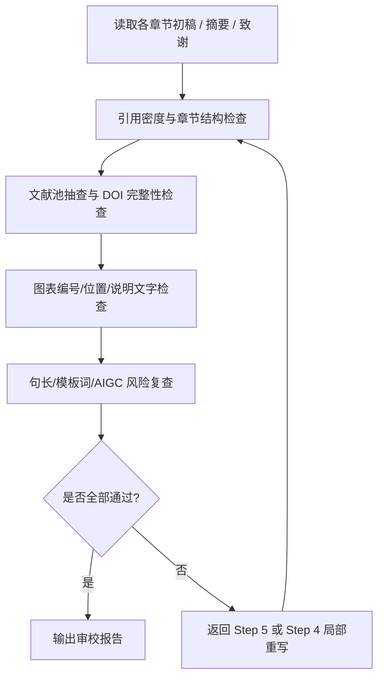

# Step 6: 审校润色

> **状态管理(强制执行)**：
> 1. 启动前：`python scripts/status_manager.py thesis-workspace/ --ensure`
> 2. 启动时：`python scripts/status_manager.py thesis-workspace/ --check-step 6`
> 3. 前置条件通过后：`--update-step 6 --action start`
> 4. 完成后：`--update-step 6 --action complete`
>
> **统一入口(推荐)**：`python scripts/lifecycle.py --workspace thesis-workspace/ --step 6 --event start|complete`

> **目标**：在 Step 7 合并前完成引用、图表、语言风格和 AIGC 风险的集中审校，提前发现需要回退修改的问题。

---

## 6.1 本轮执行边界

> **说明**：本轮采用“文档 + 轻脚本”方案。
>
> - Step 6 **定义完整检查链**，并给出建议命令。
> - Step 6 **不会**在 `lifecycle.py` 中实现强阻断状态机。
> - 若检查不通过，必须人工回退到 Step 5 或 Step 4 局部重写后再复检。

---

## 6.2 审校流程



---

## 6.3 必查项

| 检查项 | 目标 | 建议工具/命令 | 不通过处理 |
|--------|------|---------------|-----------|
| 引用密度检查 | 每千字至少 2 条引用，且引用来自文献池 | 人工核对 + `format_checker.py` 辅助 | 补充引用后重查 |
| 文献池 DOI 完整性抽查 | 章节中拟引用文献应来自 `verified_references.yaml`，且 DOI 字段完整 | 人工抽查 `verified_references.yaml` + `verified_reference_pool.py` 推荐结果 | 替换文献或回退 Step 4/5 |
| 图表编号与位置 | 图名/表名/图文顺序符合规范 | 人工核对章节内容 | 调整排版与说明文字 |
| 模板词与句长波动 | 降低模板化表达，避免句式过于均匀 | `aigc_detect.py` + 人工改写 | 回退 Step 5 深改 |
| AIGC 风险复查 | 为 Step 7 合并前做预检 | `aigc_detect.py` | 未通过不得进入 Step 7 完成态 |

---

## 6.4 建议命令

```bash
# 1) 章节格式与基础结构检查（可按章节逐个执行）
python scripts/format_checker.py --dir workspace/drafts/

# 2) 基于章节关键词复核文献池候选结果，确认引用来源与 DOI 完整性
python scripts/verified_reference_pool.py --recommend --keywords "章节关键词1 章节关键词2" --limit 5

# 3) 对高风险章节进行 AIGC 复查
python scripts/aigc_detect.py workspace/drafts/chapter_4.md
python scripts/aigc_detect.py workspace/drafts/chapter_5.md

# 4) 必要时对摘要与终稿候选章节补做检测
python scripts/aigc_detect.py workspace/drafts/摘要.md
```

> **说明**：`workspace/drafts/参考文献.md` 由 Step 7 的 `merge_drafts.py` 生成，因此 `reference_validator.py --validate-online --check-404` 属于 Step 7 合并后的强制校验，不在 Step 6 直接执行。

---

## 6.5 回退规则

1. **引用密度不足**：回退 Step 4，对对应章节补充来自文献池的引用。
2. **文献池候选条目缺少 DOI 或来源不明**：优先在文献池中替换文献，必要时回退 Step 4/5 重写相关段落。
3. **图表编号或图文顺序错误**：回退 Step 4 调整排版，不得带病进入 Step 7。
4. **AIGC 风险仍高**：回退 Step 5 深度改写，必要时返回 Step 4 重新组织段落与句式。
5. **任一关键检查未通过**：Step 6 仅能保持进行中，不能视为完成。

---

## 6.6 输出文件

- `workspace/reports/review_report.md` - 审校汇总报告
- `workspace/reports/aigc_review_notes.md` - AIGC 复查记录（人工整理亦可）

---

## 6.7 通过标准

满足以下条件后，才建议进入 Step 7：

- 各章节引用密度达标
- 章节中拟引用文献均可在 `verified_references.yaml` 中追溯，且抽查 DOI 完整
- 图表编号、位置和说明文字符合规范
- 高风险章节已完成 AIGC 复查并处于可接受范围
- 审校报告已输出到 `workspace/reports/`
- Step 7 中仍须继续执行 `reference_validator.py --validate-online --check-404` 作为合并后的强制校验
