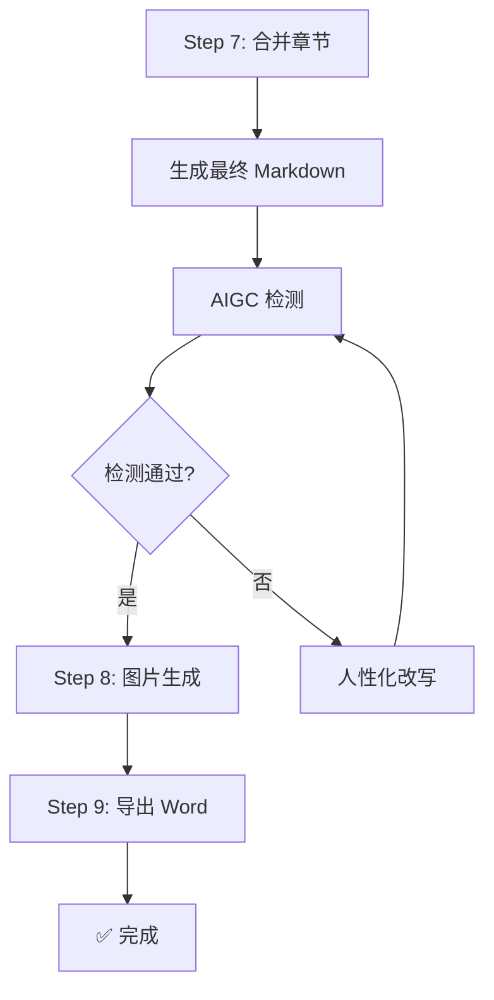

# Step 7: 合并与检测

> **状态管理(强制执行)**：
> 1. 启动前：`python scripts/status_manager.py thesis-workspace/ --ensure`
> 2. 启动时：`python scripts/status_manager.py thesis-workspace/ --check-step 7`
> 3. 前置条件通过后：`--update-step 7 --action start`
> 4. 完成后：`--update-step 7 --action complete`
>
> **统一入口(推荐)**：`python scripts/lifecycle.py --workspace thesis-workspace/ --step 7 --event start|complete`

---

## 流程顺序(重要)



> **⚠️ 流程顺序**：合并 → 检测 → 图片生成 → 导出 Word

---

## ⚠️ 合并规则(铁律)

> **禁止使用 LLM 上下文合并文档！**
>
> LLM 上下文合并会导致：
> - 内容丢失(上下文窗口限制)
> - 格式混乱(Markdown 标记错乱)
> - 章节顺序错误
> - 章节拼接顺序错误
>
> **必须使用 `scripts/merge_drafts.py` Python 脚本合并！**

---

## 7.1 章节合并

使用 `scripts/merge_drafts.py` 合并各章节文件：

```bash
# 合并所有章节（仅合并，不处理文献）
python scripts/merge_drafts.py -i workspace/drafts/ -o workspace/final/论文终稿.md --outline workspace/outline.md

# 输出简要结果（不打印详细报告）
python scripts/merge_drafts.py -i workspace/drafts/ -o workspace/final/论文终稿.md --outline workspace/outline.md --no-report
```

### 合并脚本执行的关键操作

1. **自动匹配章节文件名并按顺序拼接**（支持 `chapter_1.md` / `chapter-1.md` / `chapter_1_xxx.md` / `第1章xxx.md`）
2. **清理章节冗余分隔符和空白**，统一版式
3. **自动补充分页标记**（章节间分页）
4. **生成最终 Markdown 文件**（`workspace/final/论文终稿.md`）

---

## 7.2 AIGC 检测

调用 `scripts/aigc_detect.py` 进行检测：

```bash
python scripts/aigc_detect.py workspace/final/论文终稿.md
```

---

## 7.3 检测不通过处理

- 若 AIGC 检测不通过：返回 Step 5/6 进行人性化改写后，再回到 Step 7 复检。
- 检测通过后：进入 Step 8 图片生成。

---

## 输出文件

- `workspace/final/论文终稿.md` - 终稿(Markdown)
- `workspace/final/quality_report.md` - 质量报告

