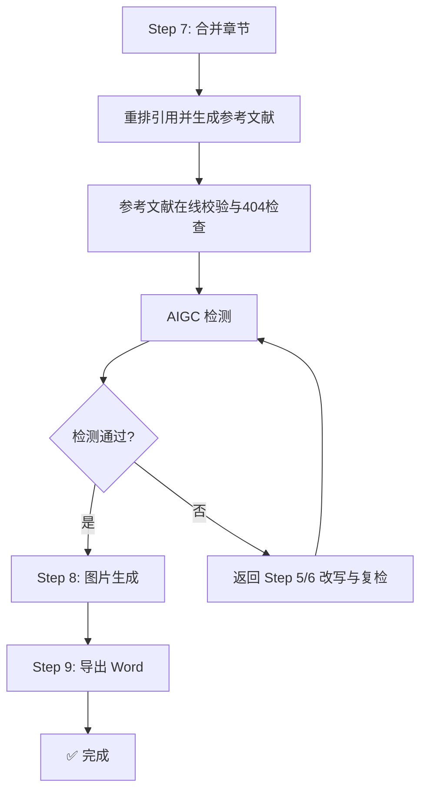

# Step 7: 合并与检测

> **状态管理(强制执行)**：
> 1. 启动前：`python scripts/core/status_manager.py thesis-workspace/ --ensure`
> 2. 启动时：`python scripts/core/status_manager.py thesis-workspace/ --check-step 7`
> 3. 前置条件通过后：`--update-step 7 --action start`
> 4. 完成后：`--update-step 7 --action complete`
>
> **统一入口(推荐)**：`python scripts/core/lifecycle.py --workspace thesis-workspace/ --step 7 --event start|complete`

---

## 流程顺序(重要)



> **⚠️ 流程顺序**：合并 → 引用重排/生成参考文献 → 在线校验 → AIGC 检测 → 图片生成 → 导出 Word

---

## ⚠️ 合并规则(铁律)

> **禁止使用 LLM 上下文合并文档！**
>
> LLM 上下文合并会导致：
> - 内容丢失(上下文窗口限制)
> - 格式混乱(Markdown 标记错乱)
> - 章节顺序错误
> - 章节拼接顺序错误
>
> **必须使用 `scripts/content/merge_drafts.py` Python 脚本合并！**

---

## 7.1 章节合并

使用 `scripts/content/merge_drafts.py` 合并各章节文件：

```bash
# 合并所有章节，并完成引用重排与参考文献生成
python scripts/content/merge_drafts.py -i workspace/drafts/ -o workspace/final/论文终稿.md --references workspace/references/verified_references.yaml --outline workspace/outline.md

# 输出简要结果（不打印详细报告）
python scripts/content/merge_drafts.py -i workspace/drafts/ -o workspace/final/论文终稿.md --references workspace/references/verified_references.yaml --outline workspace/outline.md --no-report
```

### 合并脚本执行的关键操作

1. **自动匹配章节文件名并按顺序拼接**（支持 `chapter_1.md` / `chapter-1.md` / `chapter_1_xxx.md` / `第1章xxx.md`）
2. **清理章节冗余分隔符和空白**，统一版式
3. **自动补充分页标记**（章节间分页）
4. **按正文首次出现顺序重排临时引用编号**（`[ref_001] → [1]`）
5. **校验单篇文献是否被重复占用**：若同一 `ref_id` 在终稿中出现多次，必须硬阻断并回退修正，禁止带重复引用进入 AIGC 检测
6. **从 `verified_references.yaml` 生成独立参考文献文件**（`workspace/drafts/参考文献.md`）
7. **生成最终 Markdown 文件**（`workspace/final/论文终稿.md`）

---

## 7.2 参考文献在线校验

> **硬约束**：`workspace/drafts/参考文献.md` 生成后，进入 AIGC 检测前必须执行在线验证与 404 检查。

```bash
python scripts/references/reference_validator.py workspace/drafts/参考文献.md --validate-online --check-404
```

- 允许继续的状态：`verified_doi`、`verified_metadata_only`、`broken_doi_metadata_ok`
- 必须阻断并先修复的状态：`missing_doi_unverified`、`invalid_reference`
- 若存在 `missing_doi_unverified` 或 `invalid_reference`：先替换文献或回退 Step 6 审校后，再重新执行 Step 7。
- 仅当参考文献在线校验通过后，才允许继续表达质量复查。

---

## 7.3 AIGC 检测

调用 `scripts/aigc/detect.py` 进行检测：

```bash
python scripts/aigc/detect.py --input workspace/final/论文终稿.md
```

---

## 7.4 检测不通过处理

- 若 AIGC 检测不通过：必须返回 Step 5/6 进行人性化改写与审校后，再回到 Step 7 复检。
- **AIGC 未通过时，禁止进入 Step 8 图片生成或 Step 9 导出。**
- 检测通过后：进入 Step 8 图片生成。

---

## 7.5 进入 Step 8 前的硬门禁清单（强制全部通过）

> **铁律**：以下五条任一未通过，禁止把 Step 7 标记为 completed，更禁止开始 Step 8。
> 状态机会在 `--update-step 7 --action complete` 时自动校验产物是否存在，缺失即阻断。

| # | 门禁项 | 校验脚本 | 不通过处理 |
|---|--------|----------|-----------|
| 1 | 章节合并已完成 | `workspace/final/论文终稿.md` 存在且 ≥ 大纲全部章节 | 回 Step 4 补章 |
| 2 | 参考文献已独立生成 | `workspace/drafts/参考文献.md` 存在，GB/T 7714 格式 | 重跑 `merge_drafts.py` |
| 3 | 单篇文献仅占用一次 | `merge_drafts.py` 自检日志无 "duplicate ref_id" | 回 Step 4 改写引用 |
| 4 | 参考文献在线校验通过 | `python scripts/references/reference_validator.py workspace/drafts/参考文献.md --validate-online --check-404` 退出码 0 | 替换 404 文献或回 Step 6 审校 |
| 5 | AIGC 检测通过 | `python scripts/aigc/detect.py --input workspace/final/论文终稿.md`（CS/SE 学科可选 `technical_detect.py`）；AIGC 比例 ≤ `.thesis-runtime-config.yaml` 中 `aigc.threshold`（默认 0.30） | 回 Step 5/6 改写后重新合并并复检 |

### 一键自检命令

```bash
# 校验状态机产物一致性（防止 status.json 标记 completed 但产物缺失）
python scripts/core/status_manager.py thesis-workspace/ --verify-step 7

# 等价 lifecycle 入口
python scripts/core/lifecycle.py --workspace thesis-workspace/ --reconcile
```

### 失败案例（必须避免）

> 2026-05-22 thesis-workspace 案例：未执行 AIGC 检测和 reference_validator 就直接进 Step 8 图片生成，
> 导致终稿中遗留虚假文献链接和 AI 模板词，最终交付前必须返工。
> 后续每次 Step 7→Step 8 切换，必须先 `--verify-step 7` 通过。

---

## 输出文件

- `workspace/final/论文终稿.md` - 终稿(Markdown)
- `workspace/drafts/参考文献.md` - 独立参考文献列表（GB/T 7714）
- `workspace/reports/reference_validation_*.md` - 参考文献在线校验报告

