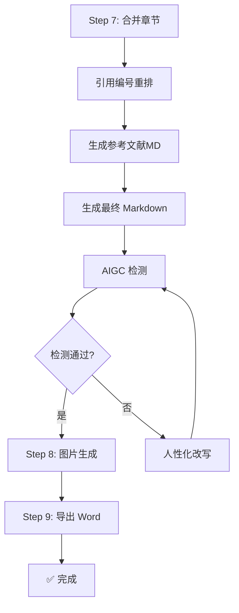

# Step 7: 合并与检测

---

## 流程顺序（重要）



> **⚠️ 流程顺序**：合并 → 引用编号重排 → 生成参考文献MD → 检测 → 图片生成 → 导出 Word

---

## ⚠️ 合并规则（铁律）

> **禁止使用 LLM 上下文合并文档！**
>
> LLM 上下文合并会导致：
> - 内容丢失（上下文窗口限制）
> - 格式混乱（Markdown 标记错乱）
> - 章节顺序错误
> - 引用编号冲突
>
> **必须使用 `scripts/merge_drafts.py` Python 脚本合并！**

---

## 7.1 章节合并

使用 `scripts/merge_drafts.py` 合并各章节文件：

```bash
# 合并所有章节（自动处理引用编号重排 + 生成参考文献MD）
python scripts/merge_drafts.py -i workspace/drafts/ -o workspace/final/论文终稿.md --references workspace/verified_references.yaml

# 查看统计信息
python scripts/merge_drafts.py -i workspace/drafts/ -o workspace/final/论文终稿.md --references workspace/verified_references.yaml --stats
```

### 合并脚本执行的关键操作

1. **按 CHAPTER_ORDER 顺序拼接**各章节 MD 文件
2. **收集所有临时引用编号**（`[ref_XXX]` 格式）
3. **按正文出现顺序重新编号**：`[ref_001]` → `[1]`，`[ref_012]` → `[2]`...
4. **从 `verified_references.yaml` 提取对应文献**，按 GB/T 7714 格式生成参考文献列表
5. **输出独立的参考文献 MD 文件**：`workspace/final/参考文献.md`
6. **在论文终稿末尾插入参考文献引用**：`<!-- REFERENCES: workspace/final/参考文献.md -->`

---

## 7.2 参考文献独立 MD 文件

合并完成后，参考文献独立存放在 `workspace/final/参考文献.md`，格式如下：

```markdown
# 参考文献

[1] Lewis P, Perez E, Piktus A, et al. Retrieval-Augmented Generation for Knowledge-Intensive NLP Tasks[C]//NAACL 2020. 2020. [DOI](https://doi.org/10.18653/v1/2020.naacl-main.13)

[2] Brown T, Mann B, Ryder N, et al. Language Models are Few-Shot Learners[J]. NeurIPS, 2020, 33: 1877-1901. [DOI](https://doi.org/10.5555/3495724.3495883)

[3] 张三, 李四. 大数据技术在精准营销中的应用研究[J]. 管理科学学报, 2023, 26(3): 45-52.
```

> **参考文献数量控制**：最终参考文献数量不得超出用户选择的上限（如20-30篇上限，最终数量应在15-35篇之间）。如超出，按相关度排序后截取。

---

## 7.3 AIGC 检测

调用 `scripts/aigc_detect.py` 进行检测：

```bash
python scripts/aigc_detect.py workspace/final/论文终稿.md
```

---

## 7.4 参考文献验证

调用 `scripts/reference_validator.py` 验证：

```bash
# 在线验证
python scripts/reference_validator.py workspace/final/参考文献.md --validate-online

# 仅格式检查
python scripts/reference_validator.py workspace/final/参考文献.md --offline
```

---

## 输出文件

- `workspace/final/论文终稿.md` - 终稿（Markdown，引用编号已重排）
- `workspace/final/参考文献.md` - 参考文献（独立 MD 文件，GB/T 7714 格式）⭐
- `workspace/final/quality_report.md` - 质量报告
- `workspace/reports/reference_validation_*.md` - 参考文献验证报告