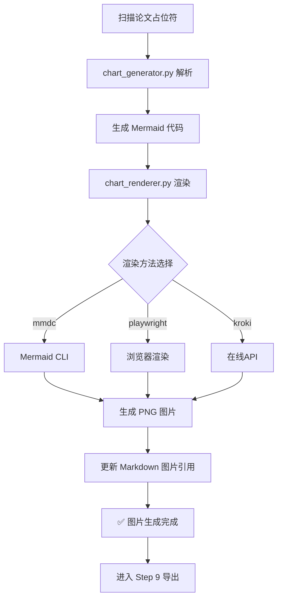

# Step 8: 图片生成与渲染

> **整合流程：图片生成 → 渲染 → 插入到 Word**

---

## 完整工作流



---

## 支持的图片类型

| 图片类型 | Mermaid 语法 | 适用章节 | 示例 |
|----------|-------------|----------|------|
| 系统架构图 | `graph TB` | 第4章 系统设计 | 三层架构、模块关系 |
| 流程图 | `flowchart TD` | 第4-5章 功能设计/实现 | 登录流程、业务流程 |
| E-R 图 | `erDiagram` | 第4章 数据库设计 | 实体关系图 |
| 用例图 | `graph LR` | 第4章 需求分析 | 用户用例 |
| 时序图 | `sequenceDiagram` | 第5章 接口调用 | API交互时序 |
| 类图 | `classDiagram` | 第5章 类设计 | 类结构关系 |

---

## 执行命令

```bash
# 方式1: 分步执行
# Step 1: 从占位符生成 Mermaid 代码
python scripts/chart_generator.py workspace/drafts/ --output workspace/final/images/

# Step 2: 渲染 Mermaid 为 PNG
python scripts/chart_renderer.py --input workspace/final/论文终稿.md --output workspace/final/images/ --method auto

# 方式2: 一键完成（推荐）
# AI 自动执行完整流程
```

---

## 渲染方法选项

| 方法 | 说明 | 优先级 | 依赖 |
|------|------|--------|------|
| `mmdc` | Mermaid CLI（本地） | 1 | `npm install -g @mermaid-js/mermaid-cli` |
| `playwright` | 浏览器渲染（本地） | 2 | `pip install playwright && playwright install` |
| `kroki` | 在线 API | 3 | 需要网络 |
| `auto` | 自动选择（按优先级尝试） | - | 已安装的优先 |

---

## 输出文件

- `workspace/final/images/图X-X.png` - 渲染后的图片
- `workspace/final/images/image_manifest.md` - 图片清单