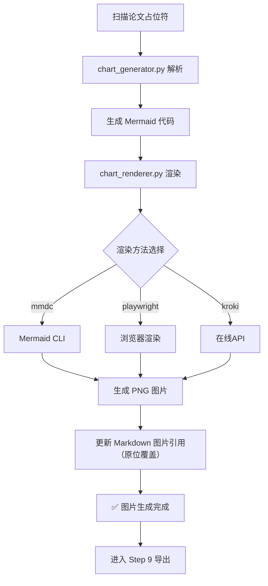

# Step 8: 图片生成与渲染

> **状态管理（强制执行）**：
> 1. 启动前：`python scripts/status_manager.py thesis-workspace/ --ensure`
> 2. 启动时：`python scripts/status_manager.py thesis-workspace/ --check-step 8`
> 3. 前置条件通过后：`--update-step 8 --action start`
> 4. 完成后：`--update-step 8 --action complete`
>
> **统一入口（推荐）**：`python scripts/lifecycle.py --workspace thesis-workspace/ --step 8 --event start|complete`

> **整合流程：图片生成 → 渲染 → 插入到 Word**

---

## 完整工作流



---

## 系统设计章节双图策略（硬约束）

| 图表 | 来源 | 占位符标记 |
|------|------|------------|
| 系统整体架构图 | **用户手动提供** | `<!-- 用户提供图片：图4-1 系统架构图 -->` |
| 系统功能模块图 | **用户手动提供** | `<!-- 用户提供图片：图4-2 系统功能模块图 -->` |
| 各模块业务流程图 | **脚本自动生成** | 标准图表占位符 |
| E-R 图 | **脚本自动生成** | 标准图表占位符 |

> `chart_generator.py` 会识别 `用户提供图片` 占位符并在报告中列出待手填图片清单。

---

## 支持的图片类型

| 图片类型 | Mermaid 语法 | 适用章节 | 示例 |
|----------|-------------|----------|------|
| 系统架构图 | `graph TB` | 第4章 系统设计 | 三层架构、模块关系 |
| 功能模块图 | `graph TB` | 第4章 系统设计 | 系统→模块→功能树状结构 |
| 流程图 | `flowchart TD` | 第4-5章 功能设计/实现 | 登录流程、业务流程 |
| E-R 图 | `erDiagram` | 第4章 数据库设计 | 实体关系图 |
| 用例图 | `graph LR` | 第4章 需求分析 | 用户用例 |
| 时序图 | `sequenceDiagram` | 第5章 接口调用 | API交互时序 |
| 类图 | `classDiagram` | 第5章 类设计 | 类结构关系 |

---

## 图表尺寸约束（硬约束）

| 约束项 | 要求 |
|--------|------|
| 流程图节点数 | 每张图 ≤ 10 个节点（超出自动拆分为多张子图） |
| E-R 图实体数 | 每张图 ≤ 6 个实体 |
| 模块图层级 | 最多 2 层（系统→子模块→功能） |
| 渲染高度 | Mermaid 渲染高度上限 800px |
| 导出高度 | Word 插图高度不超过 12cm |
| 图文比例 | 每页至少 40% 文字内容 |

---

## 执行命令

```bash
# 方式1: 分步执行
# Step 1: 从占位符生成 Mermaid 代码（原位替代，不产生副本）
python scripts/chart_generator.py workspace/final/论文终稿.md --output workspace/final/images/ --replace

# 若有章节上下文，可传入 --context 提升流程图步骤匹配准确度
python scripts/chart_generator.py workspace/final/论文终稿.md --output workspace/final/images/ --replace --context workspace/drafts/chapter_4.md

# Step 2: 渲染 Mermaid 为 PNG，并更新 Markdown（原位覆盖 mermaid 代码块为图片引用）
python scripts/chart_renderer.py --input workspace/final/论文终稿.md --output workspace/final/images/ --method auto --update

# 方式2: 一键完成（推荐）
# AI 自动执行完整流程
```

---

## 渲染方法选项

| 方法 | 说明 | 优先级 | 依赖 |
|------|------|--------|------|
| `mmdc` | Mermaid CLI（本地） | 1 | `npm install -g @mermaid-js/mermaid-cli` |
| `playwright` | 浏览器渲染（本地） | 2 | `pip install playwright && playwright install` |
| `kroki` | 在线 API | 3 | 需要网络 |
| `auto` | 自动选择（按优先级尝试） | - | 已安装的优先 |

---

## 调试与验收（拆分烟测）

```bash
# 1) 生成一个超长流程图样例（>10节点）
# 文件路径：workspace/final/_cc_chart_split_smoke.md

# 2) 生成 Mermaid（会触发自动拆分）
python scripts/chart_generator.py workspace/final/_cc_chart_split_smoke.md --output workspace/final/images/ --replace --report

# 3) 渲染并回写 Markdown
python scripts/chart_renderer.py --input workspace/final/_cc_chart_split_smoke.md --output workspace/final/images/ --method auto --update --report

# 4) 验收点
# - 终稿中出现两张图（如 图9-1-1、图9-1-2）
# - images/ 下存在对应 PNG
# - render_report.md 显示渲染成功数量与拆分数量一致
```

---

## 输出文件

- `workspace/final/images/图X-X.png` - 渲染后的图片
- `workspace/final/images/chart_report.md` - 占位符分析报告（可选，`chart_generator.py --report`）
- `workspace/final/images/render_report.md` - 图表渲染报告（可选，`chart_renderer.py --report`）